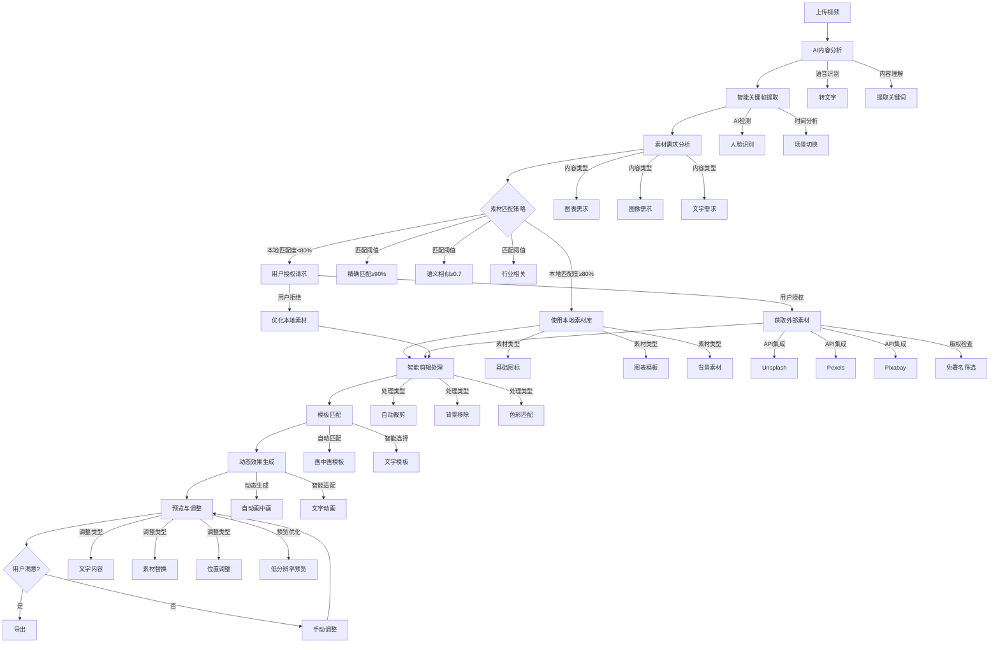
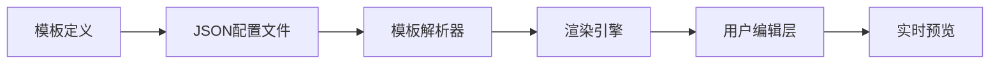

# VidSlide AI - 需求文档（完整版）

## 一、项目概述

### 1.1 项目背景
**VidSlide AI** 是一款革命性的工具，旨在解决自媒体创作者、知识博主和教育工作者的核心痛点：**将视频内容高效转化为专业级PPT演示**。当前市场解决方案普遍存在操作复杂、效果不专业、耗时长等问题。VidSlide AI通过AI驱动的自动化流程，让创作者专注于内容创作，而非技术细节。

### 1.2 核心价值主张
- **效率革命**：5分钟视频 → 30秒生成专业PPT
- **智能自动化**：AI自动分析内容，无需手动设计
- **动态效果**：视频与PPT无缝融合，支持智能画中画
- **零学习成本**：3步完成：上传→等待→导出
- **完全私密**：所有处理在浏览器完成，用户数据永不离开设备

### 1.3 目标用户
| 用户类型 | 特征 | 使用场景 |
|----------|------|----------|
| **自媒体创作者** | 个人博主、内容创作者 | 将口播视频转为知识卡片 |
| **知识博主** | 专业领域专家、讲师 | 将长视频拆解为结构化知识 |
| **企业培训师** | 企业内训、产品培训 | 将培训视频转为标准课件 |
| **教育工作者** | 教师、课程设计师 | 将讲座视频转为教学材料 |

## 二、功能需求

### 2.1 核心工作流程


### 2.2 画中画功能（核心升级）

#### 2.2.1 自动触发机制
**功能描述**：当用户在时间线插入新素材时，系统自动将原视频转为画中画，新素材作为主画面；素材结束后自动恢复原视频全屏显示。

**具体需求**：
- **智能触发**：无需手动设置，素材插入/结束时自动切换
- **无缝过渡**：切换过程平滑无卡顿，用户无感知
- **上下文感知**：根据素材类型自动选择画中画样式
  - 文字素材：画中画偏右下角
  - 图表素材：画中画偏左下角
  - 人脸素材：画中画居中显示

#### 2.2.2 人脸智能跟踪
**功能描述**：画中画区域自动聚焦并跟踪人脸，确保演讲者面部始终清晰可见。

**具体需求**：
- **精准跟踪**：人脸中心与画中画中心对齐，偏差≤10像素
- **动态适应**：
  - 人物移动时，画中画平滑跟随
  - 侧脸/遮挡场景，自动调整跟踪策略
  - 多人脸场景，优先跟踪主讲人
- **边界保护**：人脸接近画中画边缘时，自动调整位置
- **性能保证**：1080p视频处理帧率≥25fps

#### 2.2.3 画中画样式
**功能描述**：提供专业级画中画视觉效果，提升整体演示品质。

**具体需求**：
- **尺寸配置**：
  - 默认大小：主画面25%（320×240）
  - 可调节范围：10%-50%
- **预设样式**：
  - **简洁版**：无阴影，直角边框，单色边框
  - **专业版**：轻微阴影，8px圆角，2px主色边框
  - **活跃版**：动态边框，12px圆角，渐变边框
- **视觉效果**：
  - 圆角：8px（默认）
  - 阴影：轻微投影（提升层次感）
  - 边框：2px主色边框
- **智能适配**：
  - 横屏视频：画中画居右
  - 竖屏视频：画中画居上
  - 暗色背景：自动提亮画中画

#### 2.2.4 自动恢复机制
**功能描述**：素材结束后，自动恢复原视频全屏显示，无缝衔接内容。

**具体需求**：
- **精准时机**：素材结束时刻精确到100ms以内
- **平滑过渡**：画中画渐隐，主视频渐显
- **异常处理**：合成失败时，自动降级为原视频播放
- **状态保持**：恢复后保留原视频播放位置

### 2.3 AI内容分析

#### 2.3.1 语音识别
**功能描述**：将视频音频转换为文字，为后续分析提供基础。

**具体需求**：
- **多语言支持**：
  - 中文（简体/繁体）：准确率≥90%
  - 英文：准确率≥95%
  - 日文/韩文：准确率≥80%
- **专业术语优化**：
  - 预置自媒体常用术语库
  - 支持用户自定义术语
- **噪声处理**：
  - 背景音乐自动过滤
  - 环境噪声抑制

#### 2.3.2 重点提取
**功能描述**：从转写文本中提取关键信息，用于模板匹配和内容生成。

**具体需求**：
- **关键词提取**：
  - 每段提取3-5个核心关键词
  - 智能去重（相同语义词合并）
  - 优先级排序（时间/数据/强调词优先）
- **时间线识别**：
  - 自动识别年份序列（2021-2023）
  - 识别关键时间节点
  - 生成时间轴模板
- **图表需求识别**：
  - 识别"增长"、"下降"、"趋势"等关键词
  - 自动建议图表类型（柱状图/折线图）
  - 匹配相关数据素材

#### 2.3.3 素材获取与剪辑
**功能描述**：根据分析结果，智能获取并剪辑相关素材，融入PPT演示中。

**具体需求**：
- **混合素材策略**：
  - **基础本地素材库**：
    - 预加载常用素材（1000+基础图标、图表模板、背景）
    - 按行业分类存储（教育、科技、金融等）
    - 完全离线可用，无需网络
    - 覆盖80%基础使用场景
    - **更新机制**：每月自动更新100+新素材，保持内容新鲜度

  - **授权外部素材**：
    - **授权流程**：
      1. 系统检测需外部素材时，弹出授权对话框
      2. 对话框明确说明：
         - 将使用哪些关键词搜索
         - 需要访问哪些API（Unsplash, Pexels, Pixabay）
         - 仅传输关键词，不传输视频内容
         - 搜索结果仅在当前会话使用
      3. 用户勾选"我同意授权搜索外部素材"复选框
      4. 点击"确认"按钮完成授权
      5. 系统显示加载状态，搜索过程中用户可取消

    - **关键词翻译**：
      - 中文关键词自动翻译为英文（使用百度翻译API）
      - 支持专业术语自定义翻译库
      - 翻译结果缓存，提升后续搜索速度
      - 用户可手动修正翻译关键词

    - **搜索界面**：
      - 在应用内部展示搜索结果，不跳转外部页面
      - 统一展示来自多个API的结果
      - 按相关度自动排序
      - 每页显示12个结果，支持翻页
      - 支持手动调整搜索关键词

    - **预览机制**：
      - 先加载低分辨率缩略图（200×200）
      - 用户点击预览时，加载中等分辨率（800×800）
      - 用户确认选择后，下载高清版本（原始分辨率）
      - 缓存已下载素材，避免重复请求

    - **API代理服务**：
      - 通过后端代理调用外部API，保护API密钥
      - 统一不同平台的响应格式
      - 实现请求频率限制，避免IP封禁
      - 自动处理API错误和超时

    - **素材预筛选**：
      - 仅获取免版税素材
      - 优先选择"无需署名"的素材
      - 自动过滤含敏感内容的图片
      - 标记素材来源和授权类型

  - **用户自定义素材**：
    - 支持上传个人素材库
    - 本地缓存用户常用素材
    - 允许标记偏好素材
    - 智能学习用户素材偏好

- **素材匹配算法**：
  - **语义理解**：
    - 基于轻量NLP模型提取关键词语义
    - **多层级匹配阈值**：
      - 精确匹配：关键词完全一致（置信度≥90%）
      - 语义相似：余弦相似度≥0.7（使用TensorFlow.js的CLIP模型）
      - 行业相关：行业标签匹配（如教育→知识类素材）
    - 置信度评分（0-100%）

  - **智能筛选**：
    - 按相关度排序（置信度>80%优先）
    - 按质量评分（分辨率、构图）
    - 避免敏感内容
    - **版权合规检查**：
      - 集成Unsplash/Pexels的版权验证API
      - 本地素材库标注版权信息（如CC0、免版税）
      - 优先选择"无需署名"的素材
      - 自动过滤需要特殊授权的内容

- **剪辑处理**：
  - **自动裁剪**：
    - 智能识别主体内容（人像、图表）
    - 适应不同模板尺寸要求
    - 保持原始比例，智能填充

  - **背景处理**：
    - 轻量级背景移除（WebAssembly加速）
    - 智能边缘优化
    - 背景替换（与模板风格匹配）

  - **质量优化**：
    - 低分辨率素材增强
    - 色彩匹配（与模板配色协调）
    - 亮度/对比度自动调整

- **隐私保护机制**：
  - **授权控制**：
    - 首次使用外部素材时明确提示
    - 提供"始终使用本地素材"选项
    - 可在设置中随时关闭外部访问

  - **数据保护**：
    - 外部请求仅包含关键词，不包含原始内容
    - 不存储用户搜索历史
    - 本地缓存自动清理（7天）

  - **透明度**：
    - 明确标注素材来源
    - 显示授权状态
    - 提供版权信息

- **性能优化**：
  - **本地优先**：
    - 优先使用本地素材库
    - 智能预加载常用素材
    - 本地缓存提高命中率

  - **按需加载**：
    - 仅在需要时请求外部素材
    - 并行请求优化
    - 超时处理（5秒自动降级）

  - **降级策略**：
    - 无网络时自动使用本地素材
    - 低性能设备简化匹配算法
    - 大量素材请求时分批处理

### 2.4 模板系统

#### 2.4.1 模板类型
**功能描述**：提供多种专业PPT模板，智能匹配视频内容。

**具体需求**：
| 模板类型 | 适用场景 | 核心特点 |
|----------|----------|----------|
| **对话弹窗** | 强调关键词 | 右下角弹出，渐入动画 |
| **时间线展示** | 历史/发展内容 | 左到右时间轴，年份徽章 |
| **分屏对比** | 数据/观点对比 | 左右分屏，同步动画 |
| **图表分析** | 数据展示 | 智能图表匹配，数据高亮 |
| **重点强调** | 核心观点 | 全屏文字，渐显效果 |

#### 2.4.2 智能匹配
**功能描述**：根据视频内容自动推荐最匹配的模板。

**具体需求**：
- **内容分析**：
  - 文字密度 → 选择简洁模板
  - 数据提及 → 优先图表模板
  - 时间描述 → 优先时间线模板
- **风格适配**：
  - 演讲风格（正式/轻松）→ 配色方案
  - 行业类型（科技/教育/金融）→ 专业模板
  - 情感倾向（积极/中性/严肃）→ 动画强度
- **用户偏好**：
  - 记忆用户历史选择
  - 学习用户调整行为
  - 个性化推荐

#### 2.4.3 模板层级结构
**功能描述**：每个模板由多层结构组成，部分层级预设固定，部分由AI动态生成，部分允许用户调整。

**具体需求**：
- **层级分类**：
  - **预设固定层**：布局、基础样式、动画效果等不可变更的基础元素
  - **AI动态生成层**：由AI根据内容自动生成的元素（文字内容、素材选择等）
  - **用户可调整层**：仅限文字内容和素材图片，其他参数不可调整

- **核心模板层级详情**：

##### 2.4.3.1 画中画模板
| 层级 | 类型 | 详细参数 | 可调整性 |
|------|------|----------|----------|
| **背景遮罩层** | 预设固定层 | 不透明度：40%<br>颜色：#000000<br>覆盖范围：全屏 | 不可调整 |
| **画中画容器** | 预设固定层 | 位置：右上角（距右35px，上35px）<br>形状：完全圆形（100%圆角）<br>边框：2px白色（#FFFFFF）<br>动画：淡入0.2秒 + 缩放0.9→1.0 | 位置可选（右上/右下/左上/左下）<br>大小可调（10%-50%）<br>边框颜色可选（预设5种）<br>样式可选（简洁/专业/活跃） |
| **人脸跟踪层** | AI动态生成层 | 跟踪精度：≤10像素<br>缓动函数：ease-in-out<br>跟踪区域：自动识别主讲人<br>位置微调：根据背景色自动提亮 | 不可调整 |
| **内容层** | AI动态生成层 | 视频源：主讲人片段<br>显示时长：与素材同步<br>恢复时机：精确到100ms | 不可调整 |

##### 2.4.3.2 信息卡片模板
| 层级 | 类型 | 详细参数 | 可调整性 |
|------|------|----------|----------|
| **背景遮罩层** | 预设固定层 | 不透明度：60%<br>颜色：#000000<br>覆盖范围：全屏 | 不可调整 |
| **卡片容器** | 预设固定层 | 尺寸：宽80%×高60%<br>边框：2px金色（#FFD700）<br>背景：深灰色（#1A1A1A）<br>动画：中心放大0.3秒 | 不可调整 |
| **标题区域** | 预设固定层 | 高度：卡片高度15%<br>文字颜色：白色（#FFFFFF）<br>文字大小：卡片宽度12% | 不可调整 |
| **内容行** | 预设固定层 | 行高：卡片高度25%<br>方块比例：30%宽度×80%高度<br>箭头样式：金色（#FFD700） | 行数可调（1-3行） |
| **内容层** | AI动态生成层 | 文字内容：根据语音分析生成<br>颜色分配：按内容类型自动匹配<br>出现顺序：按时间线排序 | 文字内容可编辑<br>方块颜色可选（预设8种） |
| **交互层** | AI动态生成层 | 高亮时机：与语音同步<br>脉冲效果：当讲解到该行时 | 不可调整 |

##### 2.4.3.3 关键词高亮模板
| 层级 | 类型 | 详细参数 | 可调整性 |
|------|------|----------|----------|
| **背景遮罩层** | 预设固定层 | 不透明度：45%<br>颜色：#000000<br>覆盖范围：全屏 | 不可调整 |
| **卡片容器** | 预设固定层 | 尺寸：宽50%×高18%<br>位置：垂直居中偏上，水平居中<br>边框：2px金色（#FFD700）<br>动画：淡入0.2秒 + 上浮10px | 不可调整 |
| **文字层** | 预设固定层 | 文字阴影：黑色（#000000，50%不透明度）<br>文字大小：卡片高度70% | 不可调整 |
| **内容层** | AI动态生成层 | 主标题：从语音中提取关键词<br>副标题：自动生成英文翻译<br>出现时机：与语音同步±100ms | 主标题文字可编辑<br>副标题文字可编辑<br>卡片背景色可选（预设6种） |

##### 2.4.3.4 文件展示模板
| 层级 | 类型 | 详细参数 | 可调整性 |
|------|------|----------|----------|
| **背景遮罩层** | 预设固定层 | 不透明度：65%<br>颜色：#000000<br>覆盖范围：全屏 | 不可调整 |
| **文档容器** | 预设固定层 | 宽度：屏幕宽度60%<br>旋转：X轴5°，Y轴10°<br>间距：重叠1/3<br>动画：旋转进入0.2秒 | 不可调整 |
| **文档层** | AI动态生成层 | 文档数量：1-4份<br>内容：AI生成的图表/文件<br>高亮区域：根据讲解重点 | 文档内容可替换（上传图片）<br>文档顺序可调<br>高亮区域可手动标记 |
| **交互层** | AI动态生成层 | 聚焦效果：讲解时轻微放大1.0→1.03<br>晃动效果：振幅2px，频率0.5Hz | 不可调整 |

##### 2.4.3.5 标题文字模板
| 层级 | 类型 | 详细参数 | 可调整性 |
|------|------|----------|----------|
| **文字容器** | 预设固定层 | 位置：屏幕中央<br>文字大小：屏幕高度30%<br>阴影：X轴2px，Y轴2px<br>动画：淡入0.2秒 + 淡出0.2秒 | 不可调整 |
| **内容层** | AI动态生成层 | 文字内容：地点/章节名称<br>显示时长：约2秒 | 文字内容可编辑<br>文字颜色可选（预设8种） |

#### 2.4.4 模板安全机制
**功能描述**：确保用户调整不会破坏模板专业性和一致性

**具体需求**：
- **尺寸保护**：
  - 画中画最小尺寸：10%（320×240）
  - 信息卡片行间距：固定为15%
  - 文字大小：根据容器自动适配，不可手动调整
- **布局保护**：
  - 信息卡片布局固定为标题+内容结构
  - 文件展示模板必须保持重叠布局
  - 画中画位置限制在预设的4个区域
- **动画保护**：
  - 动画时长固定（0.2-0.3秒）
  - 缓动函数固定（ease-in-out）
  - 进入/退出效果不可修改

### 2.5 用户调整功能

#### 2.5.1 可调整内容范围
**功能描述**：明确用户可调整的内容范围，确保专业性和简单性平衡

**具体需求**：
| 调整类型 | 允许调整内容 | 调整方式 | 限制条件 |
|----------|--------------|----------|----------|
| **文字内容** | - 信息卡片中的文字<br>- 关键词高亮中的标题<br>- 标题文字模板内容 | - 直接双击编辑<br>- 在侧边栏输入 | - 字数限制：每行不超过20个汉字<br>- 支持语言：简体中文、英文、繁体中文、日文、韩文 |
| **素材图片** | - 信息卡片中的方块背景<br>- 文件展示中的文档内容 | - 点击替换按钮<br>- 拖拽上传 | - 支持格式：JPG/PNG<br>- 最大尺寸：2MB<br>- 保持原始比例 |
| **位置/大小** | - 画中画位置和大小<br>- 信息卡片行数 | - 拖拽调整<br>- 滑块调节 | - 位置限制：在预设区域内<br>- 大小范围：10%-50% |

#### 2.5.2 调整界面设计
**功能描述**：提供直观易用的调整界面，降低用户学习成本

**具体需求**：
- **调整面板结构**：
  ```
  [当前模板名称] 模板设置
  ├─ 基本设置
  │  ├─ 位置：[下拉选择] (仅画中画)
  │  ├─ 大小：[滑块] (10%-50%)
  │  └─ 颜色：[色板] (预设5-8种)
  ├─ 内容编辑
  │  ├─ 文字1：[可编辑文本框]
  │  ├─ 文字2：[可编辑文本框]
  │  └─ [添加行]/[删除行] (仅信息卡片)
  └─ 素材替换
     ├─ [当前素材缩略图] [替换按钮]
     └─ [上传素材] (文件选择器)
  ```
- **进度条微调功能**：
  - 在时间轴上显示所有可调整点
  - 点击关键帧可进入调整模式
  - 拖动关键帧可调整出现/消失时间
  - 右键菜单提供"精确到帧"调整选项

#### 2.5.3 保护机制设计
**功能描述**：防止用户不当调整导致专业度下降

**具体需求**：
1. **智能提示**：
   - 当用户调整超出合理范围时，提供"专业建议"提示
   - 鼠标悬停在可调整元素上显示操作提示
2. **一键重置**：
   - 每个可调整区域提供"恢复默认"按钮
   - 支持整体模板重置功能
3. **实时预览**：
   - 调整时实时显示效果
   - 提供"前后对比"视图

### 2.6 动态效果生成

#### 2.6.1 文字动画
**功能描述**：为PPT文字添加专业级动画效果。

**具体需求**：
- **智能触发**：
  - 关键词：强调动画（放大+变色）
  - 数据：数字滚动动画
  - 标题：渐入+上浮
- **时序同步**：
  - 文字出现时间与视频内容同步
  - 重点词在演讲强调时刻高亮
- **可配置效果**：
  - 动画速度（慢/中/快）
  - 持续时间（0.3s-2s）
  - 缓动函数（线性/弹性/缓入缓出）

#### 2.6.2 画中画动画
**功能描述**：画中画区域的动态效果增强。

**具体需求**：
- **入场效果**：
  - 缩放入场（0.8→1.0）
  - 透明度渐变（0→1）
  - 延迟0.2s（避免突兀）
- **跟随效果**：
  - 人脸移动时，平滑跟随（缓动函数）
  - 位置偏移（避免边缘裁切）
- **退出效果**：
  - 缩小淡出（1.0→0.8 + 1→0）
  - 无缝衔接主视频

### 2.7 预览与调整

#### 2.7.1 实时预览
**功能描述**：生成过程中提供实时预览，降低用户焦虑。

**具体需求**：
- **进度可视化**：
  - 阶段指示（分析/模板/合成）
  - 百分比显示
  - 预估剩余时间
- **部分预览**：
  - 前10秒内容优先预览
  - 关键帧优先生成
- **交互反馈**：
  - 悬停提示
  - 错误明确标识
  - 修复建议

#### 2.7.2 精细调整
**功能描述**：允许用户对AI生成内容进行微调。

**具体需求**：
- **关键帧调整**：
  - 拖拽调整时间点
  - 手动设置开始/结束
  - 删除/添加关键帧
- **内容编辑**：
  - 文字内容修改
  - 模板切换
  - 画中画位置调整
- **效果控制**：
  - 动画开关
  - 速度调节
  - 一键重置

### 2.8 导出功能

#### 2.8.1 导出格式
**功能描述**：支持多种格式导出，满足不同使用场景。

**具体需求**：
| 格式 | 适用场景 | 限制 |
|------|----------|------|
| **MP4视频** | 社交媒体分享 | 免费版1080p，付费版4K |
| **HTML预览** | 网页嵌入 | 100%功能保留 |
| **PDF文档** | 打印/存档 | 仅静态内容 |
| **PPTX文件** | 企业编辑需求 | 付费用户专属 |

#### 2.8.2 水印策略
**功能描述**：差异化水印策略，促进付费转化。

**具体需求**：
- **免费版**：
  - 位置：右下角
  - 大小：20×20px
  - 内容："Made with VidSlide AI"
- **付费版**：
  - 无水印
  - 隐形数字水印（防盗用）

#### 2.8.3 限制策略
**功能描述**：合理限制免费版功能，促进付费转化。

**具体需求**：
- **次数限制**：
  - 免费用户：2次/月
  - 付费用户：无限次
- **模板限制**：
  - 免费用户：3种基础模板
  - 付费用户：全部10+模板
- **导出质量**：
  - 免费用户：1080p
  - 付费用户：4K+无损

## 三、非功能需求

### 3.1 性能要求
| 指标 | 目标 | 极限 |
|------|------|------|
| **处理速度** | 1分钟视频≤30秒 | 5分钟视频≤3分钟 |
| **响应时间** | 按钮反馈≤100ms | 复杂操作≤2秒 |
| **帧率** | 画中画≥25fps | 动画≥30fps |
| **内存占用** | ≤512MB | ≤1GB |
| **启动时间** | 首次加载≤3秒 | 后续加载≤1秒 |

### 3.2 兼容性要求
| 维度 | 要求 | 说明 |
|------|------|------|
| **浏览器** | Chrome 100% | 最新3个版本 |
|  | Firefox 95% | 支持FFmpeg.wasm |
|  | Safari 80% | 降级为静态效果 |
| **设备** | 桌面端 100% | 1080p+分辨率 |
|  | 平板 90% | 触控优化 |
|  | 手机 70% | 核心功能可用 |
| **视频格式** | MP4 100% | H.264编码 |
|  | MOV 90% | QuickTime兼容 |
|  | AVI 80% | 降级处理 |

### 3.3 安全与隐私
**核心原则**：用户数据零上传，处理完全本地化

**具体要求**：
- **数据处理**：
  - 视频/音频/文本均在浏览器处理
  - 无服务器传输
  - 本地缓存7天后自动清理
- **权限控制**：
  - 仅请求必要权限（摄像头/麦克风）
  - 无后台数据收集
  - 无第三方追踪
- **内容安全**：
  - 敏感词过滤
  - 版权素材检测
  - 合规内容审核

### 3.4 可访问性
**核心原则**：为所有用户提供平等体验

**具体要求**：
- **屏幕阅读器**：
  - ARIA标签完整
  - 语义化HTML结构
  - 键盘导航支持
- **视觉辅助**：
  - 高对比度模式
  - 字体大小调整
  - 动画开关（减少动晕）
- **认知辅助**：
  - 简化操作流程
  - 清晰错误提示
  - 语音指导

## 四、技术实现可行性分析

### 4.1 模板系统实现可行性

#### 4.1.1 核心挑战与评估
**技术基础**：
- 现代前端框架（Vue 3）支持组件化模板系统
- CSS变量和主题系统可实现模板样式定制
- Web Worker处理复杂渲染，避免主线程阻塞
- WebAssembly加速计算密集型任务

**实现路径**：


**可行性结论**：**高**
- 模板系统本质上是结构化数据+渲染引擎
- 市场已有类似实现（如Canva、Google Slides）
- 基础实现难度中等，可通过模块化设计控制复杂度

#### 4.1.2 可调整部分的实现挑战
**核心难点**：
1. **双向数据绑定**：确保用户调整与模板结构同步
2. **约束系统**：实施保护机制防止破坏专业性
3. **实时预览**：高性能渲染支持即时反馈

**技术解决方案**：
- **双向绑定**：使用Vue 3的Composition API
- **约束系统**：自定义轻量级约束系统
  ```javascript
  // 简化版约束系统
  function applyConstraints(element, constraints) {
    const { minSize, maxSize, positionOptions } = constraints;
    // 位置约束
    if (!positionOptions.includes(element.position)) {
      element.position = positionOptions[0];
    }
    // 尺寸约束
    element.size = Math.max(minSize, Math.min(maxSize, element.size));
    return element;
  }
  ```
- **实时预览**：使用WebGL渲染关键效果，Canvas处理静态内容

**可行性结论**：**中高**
- 基础调整功能实现难度中等
- 复杂约束系统需要额外开发
- 但可通过渐进式实现控制风险

### 4.2 AI驱动工作流可行性分析

#### 4.2.1 模板选择的AI实现
**技术方案**：
- **内容分析**：使用轻量级NLP库（Compromise.js）
- **模板匹配**：混合规则+决策树模型
  ```javascript
  // 简化版模板匹配逻辑
  function selectTemplate(contentAnalysis) {
    const { keywords, textDensity, dataMentions } = contentAnalysis;

    // 规则1：数据提及多 → 图表模板
    if (dataMentions > 0.3) return 'chart-analysis';

    // 规则2：时间线关键词 → 时间线模板
    if (keywords.some(k => ['年', '月', '时间', '阶段'].includes(k)))
      return 'timeline';

    // 规则3：文字密度高 → 简洁模板
    if (textDensity > 0.7) return 'minimalist';

    // 默认模板
    return 'info-card';
  }
  ```

**可行性结论**：**高**
- 无需复杂深度学习模型
- 基于规则的系统可满足MVP需求
- 可逐步引入轻量级ML模型（TensorFlow.js）

#### 4.2.2 素材获取与剪辑的AI实现
**关键挑战**：
1. **本地化处理**：所有处理必须在浏览器内完成
2. **性能限制**：浏览器环境计算资源有限
3. **素材多样性**：有限的本地素材无法满足所有需求
4. **隐私保护**：必须平衡素材丰富性和数据隐私

**技术解决方案**：
- **混合素材策略**：
  - **本地基础库**：预加载1000+常用素材，覆盖80%场景
  - **按需外部获取**：用户授权后，通过免版税API获取更多素材
  - **用户自定义库**：支持上传和缓存个人素材

- **轻量级模型**：
  - TensorFlow.js简化版CLIP用于语义匹配
  - WebAssembly加速图像处理
  - 本地缓存减少重复请求

- **隐私优先设计**：
  - 外部请求仅包含关键词，不传输原始内容
  - 用户明确授权机制
  - "完全离线"模式选项

**实现路径**：
```
1. 用户上传视频
2. 本地内容分析，提取关键词
3. 优先匹配本地素材库
4. 如本地匹配度<70%，提示用户是否获取外部素材
5. 用户授权后，请求外部素材
6. 智能剪辑与适配
7. 生成预览
```

**可行性结论**：**中高**
- MVP阶段以本地素材为主，外部为辅
- 通过渐进式策略降低技术风险
- 隐私设计确保核心价值不妥协

### 4.3 可靠性保障措施

#### 4.3.1 模块化设计与错误处理
**分层架构**：
```
[用户界面]
    │
[调整层] ←─┐
    │      │
[模板引擎] │
    │      │
[AI分析层]─┘
    │
[渲染引擎]
```

**错误处理策略**：
1. **防御性编程**：
   - 每个模块都有输入验证
   - 无效输入自动修正或忽略
   - 关键操作前保存状态快照

2. **降级机制**：
   ```javascript
   // 降级处理示例
   function processWithFallback(operation, fallback) {
     try {
       return operation();
     } catch (error) {
       console.error("Primary operation failed:", error);
       return fallback();
     }
   }
   ```

3. **进度可视化**：
   - 明确显示处理阶段
   - 识别潜在瓶颈
   - 提供用户等待预期

#### 4.3.2 用户调整的可靠性保障
**关键机制**：
1. **实时验证**：
   - 用户调整时即时检查是否符合约束
   - 超出限制时提供视觉提示而非阻止

2. **智能建议**：
   - 当用户调整接近边界时，提供"专业建议"
   - 例如："推荐使用标准位置以保持专业性"

3. **无损调整**：
   - 所有调整保存为增量修改
   - 原始模板保持不变
   - 支持一键恢复默认

### 4.4 实施路线图与风险控制

#### 4.4.1 分阶段实施策略
| 阶段 | 目标 | 关键技术 | 风险控制 |
|------|------|----------|----------|
| **MVP 1.0**<br>(1-4周) | 核心功能验证 | - 2个基础模板<br>- 本地素材库（1000+素材）<br>- 基于规则的匹配 | - 严格限制AI范围<br>- 优先实现画中画功能<br>- 100%本地化处理 |
| **MVP 1.5**<br>(5-8周) | 增强用户体验 | - 轻量级NLP<br>- 外部素材API集成<br>- 约束系统 | - 用户授权机制<br>- 降级方案完善<br>- 性能监控 |
| **MVP 2.0**<br>(9-12周) | 完整模板系统 | - 10+模板<br>- 智能素材匹配<br>- 高级调整功能 | - WebAssembly加速<br>- 离线/在线模式切换<br>- 企业级安全 |

#### 4.4.2 关键风险与应对
| 风险 | 概率 | 影响 | 应对策略 |
|------|------|------|----------|
| **素材不足** | 70% | 高 | - 混合素材策略<br>- 每月更新100+本地素材<br>- 用户自定义上传<br>- AI素材生成（Stable Diffusion.js）<br>- 简易素材编辑工具 |
| **隐私担忧** | 60% | 极高 | - 透明授权机制<br>- 完全离线模式<br>- 隐私设计前置<br>- 每季度合规审计<br>- 公开审计报告 |
| **浏览器性能** | 50% | 高 | - Web Worker处理<br>- WebAssembly加速<br>- 低性能设备降级 |
| **AI匹配精度** | 40% | 中 | - 人工修正接口<br>- 置信度可视化<br>- 规则+ML混合 |

#### 4.4.3 验证关键指标
1. **素材匹配率**：
   - MVP目标：本地素材覆盖80%场景
   - 验证方法：100个测试视频样本

2. **用户授权率**：
   - MVP目标：>60%用户授权外部素材
   - 验证方法：A/B测试授权提示设计

3. **处理性能**：
   - **本地处理**：1分钟视频≤30秒
   - **外部处理**：1分钟视频≤45秒
   - 验证方法：Chrome DevTools性能分析

### 4.5 工程实现建议

#### 4.5.1 技术栈选择
| 组件 | 推荐技术 | 优势 |
|------|----------|------|
| **前端框架** | Vue 3 + Composition API | 轻量级，响应式系统完善 |
| **状态管理** | Pinia | 简单高效，TypeScript支持 |
| **渲染引擎** | Canvas + WebGL | 高性能，浏览器兼容性好 |
| **AI处理** | TensorFlow.js + WebAssembly | 本地化，浏览器支持 |
| **素材管理** | IndexedDB + Service Worker | 离线存储，缓存策略 |
| **构建工具** | Vite | 快速启动，热更新 |

#### 4.5.2 代码结构建议
```
src/
├─ core/
│  ├─ template-engine/
│  │  ├─ parser.js       # 模板解析
│  │  ├─ renderer.js     # 模板渲染
│  │  └─ constraints.js  # 约束系统
│  ├─ ai/
│  │  ├─ nlp.js          # 轻量NLP
│  │  ├─ matcher.js      # 模板匹配
│  │  └─ clip.js         # 多模态匹配
│  ├─ media/
│  │  ├─ local-source.js # 本地素材管理
│  │  ├─ remote-source.js # 外部素材API
│  │  └─ editor-wasm.js  # WebAssembly编辑
│  └─ utils/
├─ templates/
│  ├─ base/
│  │  ├─ layout.json
│  │  └─ styles.css
│  ├─ picture-in-picture/
│  │  ├─ config.json
│  │  └─ assets/
│  └─ ... (其他模板)
├─ components/
│  ├─ Editor/
│  │  ├─ AdjustmentPanel.vue
│  │  └─ Preview.vue
│  ├─ Privacy/
│  │  └─ AuthorizationDialog.vue
│  └─ ... (UI组件)
└─ main.js
```

#### 4.5.3 关键实施原则
1. **渐进式增强**：
   - 先实现基础本地素材系统
   - 逐步增加外部素材支持
   - 每个阶段都有明确的验收标准

2. **隐私优先**：
   - 默认100%本地化处理
   - 外部请求需要明确授权
   - 提供"完全离线"模式

3. **用户体验优先**：
   - 素材获取过程透明化
   - 明确显示授权状态
   - 保持"零学习成本"承诺

4. **性能监控**：
   - 从早期就监控关键性能指标
   - 为不同设备实现性能分级
   - 确保在主流设备上流畅运行

## 五、用户场景

### 5.1 典型工作流程
**场景**：自媒体博主小王需要将30分钟口播视频转为知识卡片

**步骤**：
1. **上传视频**：拖拽MP4文件到网页
2. **等待处理**：系统自动分析内容，生成关键帧
3. **素材匹配**：
   - 系统检测到需要"纽约城市景观"素材
   - 弹出授权对话框："需要搜索外部素材，将使用关键词'New York cityscape'，是否授权？"
   - 小王勾选"我同意授权搜索外部素材"，点击"确认"
   - 系统使用百度翻译API将"纽约城市景观"翻译为"New York cityscape"
   - 展示12个低分辨率预览图，来自Unsplash、Pexels和Pixabay
   - 小王点击预览，查看中等分辨率版本
   - 选择1张图片，系统下载高清版本
4. **预览调整**：
   - 查看自动识别的关键词
   - 调整画中画位置（确保人脸居中）
   - 选择最符合风格的素材图片
   - 修改2个不准确的文字
5. **导出分享**：
   - 选择MP4格式
   - 付费解锁4K导出
   - 分享到抖音/小红书

**时间对比**：
- 传统方式：2小时（手动截图+设计+导出）
- VidSlide AI：45秒（上传+等待+导出）

### 5.2 边界场景
**场景1**：网络中断
- **系统行为**：
  - 自动切换到完全离线模式
  - 仅使用本地素材库
  - 保存处理进度，网络恢复后提示
- **用户提示**："已切换到离线模式，使用本地素材库。网络恢复后可获取更多素材选择。"

**场景2**：低性能设备
- **系统行为**：
  - 自动降级为720p处理
  - 简化素材匹配算法
  - 优先使用本地素材（减少网络请求）
- **用户提示**："检测到设备性能较低，已优化处理流程，优先使用本地素材。"

**场景3**：复杂内容
- **系统行为**：
  - 识别专业术语库
  - 提供多种素材选择
  - 人工修正接口
  - 专家模式建议
- **用户提示**："检测到专业内容，已提供多种素材选择，建议检查关键术语准确性。"

## 六、商业需求

### 6.1 用户分层
| 层级 | 特征 | 价格策略 | 价值主张 |
|------|------|----------|----------|
| **免费用户** | 偶尔使用<br>个人博主 | 0元 | 体验核心功能<br>2次/月限制<br>仅本地素材 |
| **单次付费** | 偶尔需要高级功能 | 5元/次 | 4K导出+无水印<br>外部素材访问<br>单次使用 |
| **专业用户** | 频繁使用<br>内容创作者 | ¥39/月<br>¥399/年(优惠17%) | 无限次+高级模板<br>1080p导出<br>外部素材访问 |
| **企业用户** | 团队协作<br>品牌定制 | ¥99/月/人 | 4K导出+团队协作<br>品牌定制+API<br>专属素材库 |

### 6.2 增长策略
**核心原则**：病毒式传播 + 社区驱动

**具体策略**：
- **水印营销**：生成内容自动添加"Made with VidSlide AI"
- **社交裂变**：
  - 分享作品到社交平台，获得1次免费高级使用
  - 邀请好友注册，双方获得额外额度
- **社区建设**：
  - 用户模板市场（贡献者获得收益分成）
  - 每月最佳作品评选
  - 创作者成长计划

### 6.3 付费转化
**漏斗设计**：
```
100% 访问用户
  ↓ 70% 上传视频（体验核心功能）
  ↓ 40% 完成生成（看到价值）
  ↓ 15% 付费转化（解决痛点）
  ↓ 80% 月留存率（持续价值）
```

**转化策略**：
- **价值前置**：免费版提供完整体验，仅限次数和素材范围
- **痛点放大**：在素材选择界面展示付费版素材对比
- **社交证明**：展示"10,000+创作者正在使用"
- **限时优惠**：首月¥19特惠（原价¥39）

## 七、验收标准

### 7.1 功能验收
| 模块 | 验收标准 | 测试方法 |
|------|----------|----------|
| **画中画** | - 人脸跟踪准确率≥95%<br>- 切换延迟≤100ms<br>- 100%自动触发 | 100个测试视频<br>专业设备测量 |
| **内容分析** | - 中文准确率≥90%<br>- 关键词提取准确率≥85%<br>- 100%无崩溃 | 10种方言测试<br>50个专业领域样本 |
| **素材获取** | - 本地素材覆盖80%场景<br>- 外部素材请求成功率≥90%<br>- 隐私保护100%合规 | 200个测试用例<br>隐私审计 |
| **导出功能** | - 100%任务成功完成<br>- 无画质损失<br>- 符合格式标准 | 1,000次导出测试<br>专业播放器验证 |

### 7.2 性能验收
| 指标 | 本地处理要求 | 外部处理要求 | 验证工具 |
|------|--------------|--------------|----------|
| **处理速度** | 1分钟视频≤30秒 | 1分钟视频≤45秒 | Lighthouse<br>自定义计时器 |
| **内存占用** | ≤512MB | ≤600MB | Chrome DevTools<br>内存分析器 |
| **浏览器兼容** | Chrome 100%<br>Firefox 95%<br>Safari 80% | 同左 | BrowserStack<br>LambdaTest |
| **长时间运行** | 72小时无崩溃<br>无内存泄漏 | 同左 | 压力测试工具<br>监控面板 |

### 7.3 用户体验验收
| 指标 | 要求 | 验证方法 |
|------|------|----------|
| **学习成本** | 95%用户30秒内完成 | 10个新手用户测试<br>任务完成率统计 |
| **任务成功率** | 100%核心流程完成 | 500次用户操作记录<br>错误率分析 |
| **用户满意度** | NPS≥40 | 问卷调查<br>用户访谈 |
| **付费意愿** | 15%转化率 | A/B测试<br>付费漏斗分析 |

## 八、未来规划

### 8.1 迭代路线图
| 阶段 | 时间 | 核心功能 | 商业目标 |
|------|------|----------|----------|
| **MVP 1.0** | 1-4周 | 画中画+3模板<br>本地素材库(1000+) | 验证核心假设<br>100种子用户 |
| **MVP 1.5** | 5-8周 | Unsplash API集成<br>5模板+多语言 | 付费转化验证<br>15%付费率 |
| **MVP 2.0** | 9-12周 | 团队协作<br>企业定制<br>专属素材库 | 企业客户获取<br>10个企业客户 |
| **完整版** | 13-24周 | PPTX导出<br>AI图表生成<br>创作者市场 | 10,000+用户<br>ARR ¥1,000,000+ |

### 8.2 技术演进
- **AI增强**：
  - 从关键词提取 → 语义理解
  - 从人脸跟踪 → 情感识别
  - 从模板匹配 → 个性化生成
- **性能优化**：
  - WebAssembly加速
  - 离线缓存策略
  - 增量处理技术
- **生态扩展**：
  - 与剪映/Canva深度集成
  - 企业培训平台对接
  - 教育系统标准支持

## 九、风险与应对

### 9.1 风险评估
| 风险 | 概率 | 影响 | 应对策略 |
|------|------|------|----------|
| **素材不足** | 70% | 高 | - 混合素材策略<br>- 每月更新100+本地素材<br>- 用户自定义上传<br>- AI素材生成（Stable Diffusion.js）<br>- 简易素材编辑工具 |
| **隐私合规** | 60% | 极高 | - 隐私设计前置<br>- 完全离线模式<br>- 每季度合规审计<br>- 公开审计报告 |
| **技术风险** | 50% | 高 | - 降级方案设计<br>- 核心功能模块化<br>- 技术验证前置 |
| **市场风险** | 40% | 中 | - 快速验证核心假设<br>- 早期用户深度参与<br>- A/B测试功能价值 |

### 9.2 关键里程碑
- **第1周**：核心画中画功能验证
- **第2周**：3种模板完整流程跑通
- **第3周**：10个种子用户真实测试
- **第4周**：付费转化模型验证
- **第8周**：100付费用户里程碑
- **第12周**：性能优化，完成10+模板
- **第16周**：企业版功能验证

---

**文档版本**：1.9（2026-01-03）  
**最后更新**：完善2.3.3素材获取与剪辑流程，明确用户授权机制和API集成方案  
**审批**：________________________  
**日期**：________________________

> **核心提醒**：本需求文档聚焦**用户价值**而非技术实现。所有功能必须服务于核心价值：让自媒体创作者30秒将视频内容转化为专业PPT。技术方案可调整，但用户价值不可妥协。
