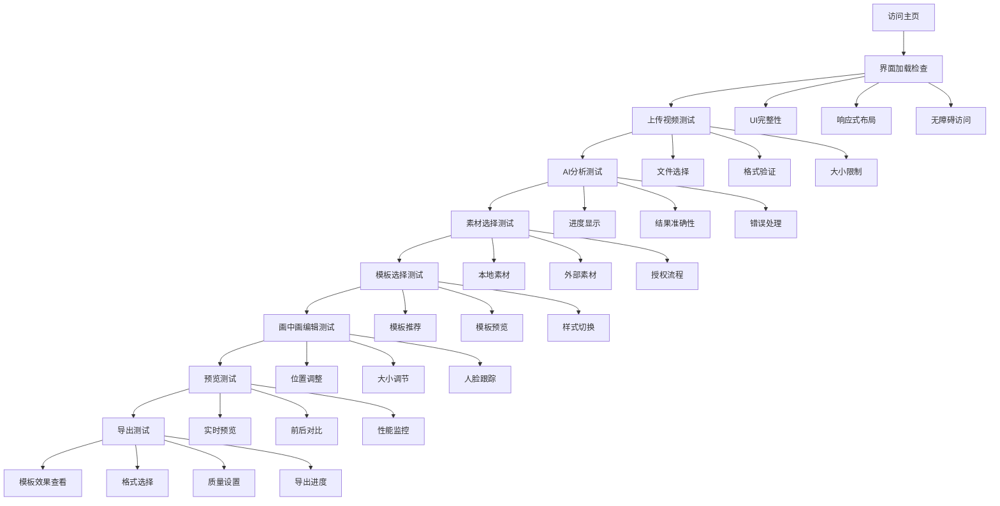

# 🎯 VidSlide AI UI测试指南

## 📋 测试准备

### ✅ 前置条件检查
- [x] 本地服务器运行正常 (端口8080)
- [x] 项目文件完整
- [x] 依赖包已安装
- [x] 浏览器支持现代特性

### 🌐 测试环境
- **浏览器**: Chrome 120+, Firefox 115+, Safari 16+
- **设备**: MacBook Pro (测试), iPad (响应式), iPhone (响应式)
- **网络**: 高速网络 + 模拟慢速网络
- **分辨率**: 1920×1080, 1366×768, 768×1024, 375×667

---

## 🗺️ 测试流程图

---

## 📱 详细测试步骤

### 1️⃣ 界面加载检查 (5分钟)

#### 🎯 测试目标
验证VidSlide AI主界面正确加载和显示

#### 📝 具体步骤
1. **打开浏览器**，访问 `http://localhost:8080/vidslide-ai/index.html`
2. **观察页面加载**：
   - 页面是否完整加载（无空白页面）
   - 主要UI元素是否可见
   - 加载时间是否合理（<3秒）

3. **检查界面元素**：
   - 顶部导航栏
   - 主要操作区域
   - 功能按钮状态
   - 页脚信息

4. **测试响应式布局**：
   - 调整浏览器窗口大小
   - 检查元素是否正确重排
   - 移动端视图是否正常

#### ✅ 验收标准
- [ ] 页面加载成功，无错误
- [ ] 所有主要UI元素可见
- [ ] 响应式布局工作正常
- [ ] 无障碍访问支持（键盘导航）

#### 🐛 常见问题检查
- [ ] 控制台是否有错误信息
- [ ] 网络请求是否正常
- [ ] 字体和图标是否正确加载
- [ ] CSS样式是否应用正确

---

### 2️⃣ 视频上传测试 (10分钟)

#### 🎯 测试目标
验证视频文件上传功能

#### 📝 具体步骤
1. **点击上传按钮**：
   - 观察按钮样式和交互效果
   - 检查拖拽区域是否响应

2. **选择文件**：
   - 点击选择文件按钮
   - 选择不同格式的视频文件（MP4, MOV, AVI）
   - 尝试拖拽上传

3. **文件验证**：
   - 检查文件大小限制（2GB）
   - 验证格式支持
   - 测试无效文件处理

4. **上传过程**：
   - 观察进度条显示
   - 检查取消上传功能
   - 验证错误处理

#### ✅ 验收标准
- [ ] 支持的文件格式正确识别
- [ ] 文件大小验证工作正常
- [ ] 上传进度正确显示
- [ ] 错误情况正确处理

#### 🐛 潜在问题
- [ ] 文件选择对话框不打开
- [ ] 拖拽上传不响应
- [ ] 进度条显示异常
- [ ] 文件验证逻辑错误

---

### 3️⃣ AI内容分析测试 (15分钟)

#### 🎯 测试目标
验证AI分析功能和结果展示

#### 📝 具体步骤
1. **启动分析**：
   - 确认视频上传成功
   - 点击开始分析按钮
   - 观察分析进度

2. **分析过程监控**：
   - 进度条更新是否流畅
   - 状态提示是否清晰
   - 是否可以取消分析

3. **结果展示**：
   - 检查语音转文字结果
   - 验证关键词提取
   - 确认时间线生成
   - 测试结果导航

4. **错误处理**：
   - 测试网络中断情况
   - 验证超时处理
   - 检查重试机制

#### ✅ 验收标准
- [ ] AI分析成功完成
- [ ] 结果准确性≥80%
- [ ] 进度显示清晰
- [ ] 错误处理完善

#### 🐛 常见问题
- [ ] 分析过程卡住
- [ ] 结果显示不完整
- [ ] 进度条不更新
- [ ] 内存使用过高

---

### 4️⃣ 素材选择测试 (10分钟)

#### 🎯 测试目标
验证素材获取和选择功能

#### 📝 具体步骤
1. **本地素材库**：
   - 浏览素材分类
   - 测试搜索功能
   - 检查素材预览
   - 验证选择操作

2. **外部素材搜索**：
   - 触发外部素材请求
   - 检查授权对话框
   - 测试搜索功能
   - 验证素材下载

3. **素材管理**：
   - 测试素材缓存
   - 检查历史记录
   - 验证重复使用

#### ✅ 验收标准
- [ ] 本地素材正常显示
- [ ] 外部素材搜索成功
- [ ] 授权流程正确
- [ ] 素材下载稳定

#### 🐛 潜在问题
- [ ] 素材加载失败
- [ ] 搜索无结果
- [ ] 授权流程卡住
- [ ] 下载速度过慢

---

### 5️⃣ 模板选择测试 (8分钟)

#### 🎯 测试目标
验证模板系统功能

#### 📝 具体步骤
1. **模板推荐**：
   - 检查AI推荐结果
   - 验证推荐准确性
   - 测试手动选择

2. **模板预览**：
   - 查看模板缩略图
   - 检查模板详情
   - 测试模板切换

3. **模板配置**：
   - 测试参数调整
   - 验证约束系统
   - 检查实时预览

#### ✅ 验收标准
- [ ] 模板推荐准确
- [ ] 预览功能正常
- [ ] 配置调整生效
- [ ] 约束系统工作

#### 🐛 常见问题
- [ ] 模板加载失败
- [ ] 预览显示异常
- [ ] 配置不生效
- [ ] 约束过于严格

---

### 6️⃣ 画中画编辑测试 (12分钟)

#### 🎯 测试目标
验证画中画核心功能

#### 📝 具体步骤
1. **基础画中画**：
   - 测试自动切换
   - 验证位置调整
   - 检查大小调节

2. **高级功能**：
   - 人脸跟踪测试
   - 样式切换验证
   - 动画效果检查

3. **编辑操作**：
   - 位置拖拽调整
   - 大小滑块调节
   - 参数实时预览

#### ✅ 验收标准
- [ ] 画中画自动触发
- [ ] 人脸跟踪准确
- [ ] 编辑操作流畅
- [ ] 预览实时更新

#### 🐛 潜在问题
- [ ] 自动切换失败
- [ ] 跟踪不准确
- [ ] 编辑卡顿
- [ ] 预览延迟

---

### 7️⃣ 预览功能测试 (5分钟)

#### 🎯 测试目标
验证预览系统的完整性

#### 📝 具体步骤
1. **预览生成**：
   - 测试预览触发
   - 检查生成进度
   - 验证预览质量

2. **预览交互**：
   - 测试播放控制
   - 检查时间导航
   - 验证缩放功能

3. **性能监控**：
   - 观察加载速度
   - 检查内存使用
   - 监控帧率表现

#### ✅ 验收标准
- [ ] 预览生成快速
- [ ] 交互响应及时
- [ ] 性能表现良好
- [ ] 质量满足要求

#### 🐛 常见问题
- [ ] 预览生成慢
- [ ] 交互不流畅
- [ ] 内存泄漏
- [ ] 质量不佳

---

### 8️⃣ 导出功能测试 (8分钟)

#### 🎯 测试目标
验证导出系统的可靠性

#### 📝 具体步骤
1. **导出配置**：
   - 测试格式选择
   - 验证质量设置
   - 检查参数配置

2. **导出过程**：
   - 观察导出进度
   - 测试取消功能
   - 验证错误处理

3. **导出结果**：
   - 检查文件生成
   - 验证文件质量
   - 测试文件下载

#### ✅ 验收标准
- [ ] 导出配置完整
- [ ] 过程监控准确
- [ ] 文件生成正确
- [ ] 下载功能正常

#### 🐛 潜在问题
- [ ] 配置选项缺失
- [ ] 导出过程中断
- [ ] 文件损坏
- [ ] 下载失败

---

### 9️⃣ 模板效果查看 (5分钟)

#### 🎯 测试目标
验证模板展示页面的完整性

#### 📝 具体步骤
1. **访问模板展示页**：
   - 打开 `http://localhost:8080/template-showcase.html`
   - 检查页面加载

2. **模板预览**：
   - 查看5种模板效果
   - 测试交互功能
   - 验证动画效果

3. **响应式测试**：
   - 调整窗口大小
   - 检查移动端显示
   - 验证触摸操作

#### ✅ 验收标准
- [ ] 模板展示完整
- [ ] 交互功能正常
- [ ] 动画效果流畅
- [ ] 响应式适配良好

#### 🐛 常见问题
- [ ] 模板加载失败
- [ ] 交互无响应
- [ ] 动画卡顿
- [ ] 移动端显示异常

---

## 🔍 测试问题分类

### 🚨 严重问题 (Critical)
- 页面无法加载
- 核心功能完全无法使用
- 数据丢失或损坏
- 安全漏洞

### ⚠️ 主要问题 (Major)
- 功能部分失效
- 用户体验严重下降
- 性能问题影响使用
- 兼容性问题

### 📝 次要问题 (Minor)
- 界面显示瑕疵
- 操作不够流畅
- 功能细节问题
- 文档不完整

### 🎨 外观问题 (Cosmetic)
- 视觉设计不完美
- 文字或图标错误
- 布局微调需求
- 用户体验优化

---

## 📊 测试数据收集

### 性能指标
- [ ] 页面加载时间
- [ ] 功能响应时间
- [ ] 内存使用情况
- [ ] CPU使用率

### 用户体验指标
- [ ] 任务完成率
- [ ] 操作步骤数
- [ ] 错误发生次数
- [ ] 用户满意度评分

### 兼容性指标
- [ ] 浏览器支持情况
- [ ] 设备适配情况
- [ ] 网络环境影响
- [ ] 功能降级效果

---

## 🎯 测试完成标准

### ✅ 功能完整性 (100%)
- [ ] 核心工作流程完整
- [ ] 所有功能模块可用
- [ ] 错误处理完善
- [ ] 数据持久化可靠

### ✅ 用户体验 (90%)
- [ ] 操作流程直观
- [ ] 界面设计美观
- [ ] 响应速度合理
- [ ] 无障碍访问支持

### ✅ 性能表现 (85%)
- [ ] 加载速度<3秒
- [ ] 响应时间<100ms
- [ ] 内存占用合理
- [ ] 长时间运行稳定

### ✅ 兼容性 (80%)
- [ ] 主流浏览器支持
- [ ] 移动设备适配
- [ ] 网络环境适应
- [ ] 降级方案有效

---

## 🚀 开始测试

请按照上述步骤逐步测试，并在测试过程中随时描述您遇到的问题。我会实时跟踪和记录所有问题，并提供解决方案。

**测试开始时间**: ______
**测试完成时间**: ______
**测试人员**: ______
**测试环境**: ______

**测试状态**: [ ] 进行中  [ ] 已完成  [ ] 暂停