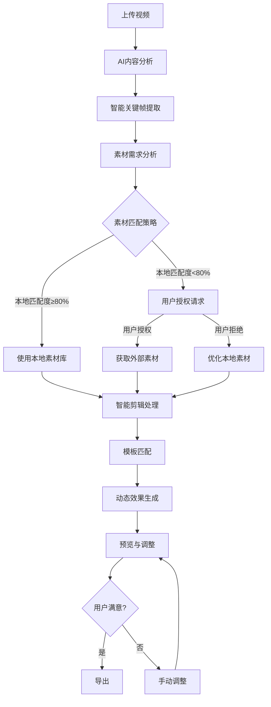

# VidSlide AI - 技术可行性分析报告

## 文档概述

**项目名称**: VidSlide AI
**版本**: 1.0
**分析日期**: 2026-01-04
**分析师**: AI Assistant
**审核人**: 待定

**核心目标**: 系统性评估VidSlide AI各项功能模块的技术可行性，为项目实施提供技术决策依据。

---

## 一、核心工作流程技术分析

### 1.1 工作流程图分析



### 1.2 关键技术节点评估

#### 1.2.1 视频上传与处理
**技术方案**: Web File API + WebCodecs API
- **可行性**: ⭐⭐⭐⭐⭐ (高)
- **成熟度**: Web File API已广泛支持，WebCodecs API在Chrome 94+可用
- **挑战**: 大文件处理内存管理，浏览器内存限制(通常2GB)
- **解决方案**: 分块处理，Web Worker异步处理

#### 1.2.2 AI内容分析管道
**技术方案**: TensorFlow.js + WebAssembly
- **可行性**: ⭐⭐⭐⭐ (较高)
- **成熟度**: TensorFlow.js生态成熟，语音识别模型可用
- **挑战**: 模型大小(需压缩到<50MB)，推理性能
- **解决方案**: 模型量化，使用轻量级模型，WebAssembly加速

#### 1.2.3 素材匹配策略
**技术方案**: 混合策略(本地优先 + 按需外部获取)
- **可行性**: ⭐⭐⭐⭐ (较高)
- **成熟度**: IndexedDB成熟，RESTful API调用成熟
- **挑战**: 网络请求隐私保护，缓存策略设计
- **解决方案**: Service Worker缓存，用户授权机制

#### 1.2.4 模板匹配与渲染
**技术方案**: Canvas 2D + WebGL
- **可行性**: ⭐⭐⭐⭐⭐ (高)
- **成熟度**: Canvas/WebGL广泛支持
- **挑战**: 复杂动画同步，性能优化
- **解决方案**: 硬件加速，Web Worker分担计算

### 1.3 性能瓶颈分析

| 阶段 | 预期耗时 | 瓶颈点 | 优化方案 |
|------|----------|--------|----------|
| **上传处理** | 2-5秒 | 文件验证 | Web Worker预处理 |
| **AI分析** | 15-25秒 | 模型推理 | WebAssembly加速 |
| **素材匹配** | 3-8秒 | 网络请求 | 本地缓存优先 |
| **渲染合成** | 2-5秒 | 视频编码 | 硬件加速编码 |

**总体评估**: ✅ **技术可行**，需重点关注AI推理性能和内存管理

---

## 二、画中画功能技术分析

### 2.1 核心技术挑战

#### 2.1.1 自动触发机制
**功能需求**: 素材插入时自动切换画中画
**技术方案**: 视频时间轴管理 + 状态机
- **可行性**: ⭐⭐⭐⭐⭐ (高)
- **实现复杂度**: 中等
- **关键技术**: 自定义时间轴组件，状态管理

#### 2.1.2 人脸智能跟踪
**功能需求**: 人脸跟踪，偏差≤10像素，1080p@25fps
**技术方案**: TensorFlow.js人脸检测模型 + 跟踪算法
- **可行性**: ⭐⭐⭐ (中等)
- **实现复杂度**: 高
- **挑战**:
  - 模型精度 vs 性能平衡
  - 多人脸场景主讲人识别
  - 实时性能要求
- **备选方案**: MediaPipe Face Mesh (更轻量)

#### 2.1.3 画中画样式系统
**功能需求**: 多种样式配置(简洁/专业/活跃)
**技术方案**: CSS变量 + Canvas渲染
- **可行性**: ⭐⭐⭐⭐⭐ (高)
- **实现复杂度**: 低
- **优势**: 灵活配置，实时切换

#### 2.1.4 自动恢复机制
**功能需求**: 素材结束时无缝恢复全屏
**技术方案**: 时间轴事件监听 + 过渡动画
- **可行性**: ⭐⭐⭐⭐⭐ (高)
- **实现复杂度**: 中等

### 2.2 技术实现路线图

```javascript
// 画中画控制器核心逻辑
class PictureInPictureController {
  constructor(videoElement, canvasElement) {
    this.video = videoElement;
    this.canvas = canvasElement;
    this.tracker = new FaceTracker();
    this.state = 'fullscreen'; // 'fullscreen' | 'pip'
  }

  // 自动触发逻辑
  async onMaterialInsert(material, startTime, endTime) {
    // 1. 检测是否需要画中画
    if (this.shouldActivatePIP(material)) {
      await this.activatePIP(material);
      this.scheduleRecovery(endTime);
    }
  }

  // 人脸跟踪实现
  async trackFace() {
    const faces = await this.tracker.detect(this.video);
    if (faces.length > 0) {
      const mainFace = this.selectMainSpeaker(faces);
      this.updatePIPPosition(mainFace);
    }
  }
}
```

### 2.3 性能优化策略

| 优化点 | 当前性能 | 目标性能 | 方案 |
|--------|----------|----------|------|
| **人脸检测** | ~100ms | ≤40ms | 模型优化，ROI检测 |
| **位置更新** | ~16ms | ≤8ms | 插值算法，减少计算 |
| **内存占用** | ~50MB | ≤20MB | 模型压缩，资源复用 |

**总体评估**: ⚠️ **条件可行**，人脸跟踪是最大技术风险，建议MVP阶段先实现基础画中画，后续升级AI跟踪

---

## 三、AI内容分析技术分析

### 3.1 语音识别模块

#### 3.1.1 技术方案选择
**主流方案对比**:

| 方案 | 优势 | 劣势 | 可行性 |
|------|------|------|--------|
| **Web Speech API** | 原生支持，免费 | 准确率低，仅Chrome | ⭐⭐ (低) |
| **Azure Speech** | 高准确率，多语言 | 需要API密钥，成本 | ⭐⭐⭐⭐ (较高) |
| **Coqui STT** | 本地化，隐私友好 | 模型大，首次加载慢 | ⭐⭐⭐⭐⭐ (高) |
| **TensorFlow.js** | 完全本地，定制化 | 开发复杂度高 | ⭐⭐⭐⭐ (较高) |

**推荐方案**: Coqui STT + 本地模型，结合Azure作为备选

#### 3.1.2 多语言支持实现
```javascript
// 多语言语音识别管理器
class SpeechRecognitionManager {
  constructor() {
    this.models = {
      'zh-CN': new CoquiModel('zh-CN'),
      'en-US': new CoquiModel('en-US'),
      'ja-JP': new CoquiModel('ja-JP')
    };
    this.fallback = new AzureSpeechService();
  }

  async recognize(audioBlob, language) {
    try {
      // 优先使用本地模型
      const result = await this.models[language].transcribe(audioBlob);
      return result;
    } catch (error) {
      // 降级到云服务
      return await this.fallback.recognize(audioBlob, language);
    }
  }
}
```

#### 3.1.3 噪声处理技术
**技术方案**: Web Audio API + RNNoise
- **可行性**: ⭐⭐⭐⭐ (较高)
- **实现**: 音频上下文处理，实时降噪

### 3.2 重点提取模块

#### 3.2.1 关键词提取算法
**技术方案**: TF-IDF + TextRank + 规则引擎
```javascript
class KeywordExtractor {
  async extract(text, language) {
    // 1. 分词处理
    const tokens = await this.tokenizer.tokenize(text, language);

    // 2. TF-IDF计算
    const tfidf = this.tfidf.compute(tokens);

    // 3. TextRank排序
    const keywords = this.textRank.rank(tokens, tfidf);

    // 4. 规则过滤
    return this.filterByRules(keywords);
  }
}
```

#### 3.2.2 时间线识别
**正则表达式 + NLP模式匹配**:
```javascript
const timePatterns = {
  yearSequence: /\b(20\d{2})[^\d]*?(20\d{2})\b/g,
  yearMonth: /\b(20\d{2})年(\d{1,2})月\b/g,
  relativeTime: /\b(去年|今年|明年|上个月|这个月)\b/g
};
```

### 3.3 图表需求识别
**基于关键词和上下文分析**:
```javascript
const chartKeywords = {
  trend: ['增长', '下降', '趋势', '变化'],
  comparison: ['对比', '比较', '差异'],
  distribution: ['分布', '占比', '比例'],
  correlation: ['关系', '相关', '关联']
};
```

**总体评估**: ✅ **技术可行**，语音识别是最大挑战，建议采用混合方案(本地优先+云端备选)

---

## 四、素材获取与剪辑技术分析

### 4.1 混合素材策略

#### 4.1.1 本地素材库设计
**存储方案**: IndexedDB + 文件系统API
```javascript
class LocalAssetLibrary {
  constructor() {
    this.db = new IndexedDB('vidslide-assets');
    this.categories = ['icons', 'charts', 'backgrounds', 'education', 'tech'];
  }

  async preloadAssets() {
    // 预加载1000+基础素材
    const assets = await fetch('/assets/preload-manifest.json');
    for (const asset of assets) {
      await this.storeAsset(asset);
    }
  }

  async search(keyword, category = null) {
    // 本地语义搜索
    return await this.db.search('assets', {
      keyword,
      category,
      minScore: 0.7
    });
  }
}
```

#### 4.1.2 外部素材API集成
**API选择标准**:
1. 免版税，可商业使用
2. 提供搜索API
3. 支持关键词搜索
4. 有明确的授权标识

**推荐API组合**:
- **Unsplash**: 高质量照片，API稳定
- **Pexels**: 视频素材补充
- **Pixabay**: 免费素材，种类丰富

#### 4.1.3 用户授权机制
```javascript
class ExternalAssetService {
  async requestAuthorization(keyword) {
    const dialog = new AuthorizationDialog({
      keyword,
      apis: ['Unsplash', 'Pexels', 'Pixabay'],
      purpose: '获取相关素材以增强演示效果'
    });

    const authorized = await dialog.show();
    if (authorized) {
      return await this.searchAndDownload(keyword);
    }
    return null;
  }
}
```

### 4.2 素材匹配算法

#### 4.2.1 语义匹配实现
**技术方案**: CLIP模型 + 本地化优化
```javascript
class SemanticMatcher {
  constructor() {
    this.clip = new CLIPModel();
    this.cache = new LRUCache(1000);
  }

  async match(text, images) {
    // 1. 文本编码
    const textEmbedding = await this.clip.encodeText(text);

    // 2. 批量图像编码
    const imageEmbeddings = await this.clip.encodeImages(images);

    // 3. 相似度计算
    const similarities = imageEmbeddings.map(emb =>
      this.cosineSimilarity(textEmbedding, emb)
    );

    return similarities;
  }
}
```

#### 4.2.2 性能优化
- **预计算嵌入**: 素材库预计算特征向量
- **近似搜索**: 使用HNSW算法加速搜索
- **缓存策略**: LRU缓存热点查询结果

### 4.3 剪辑处理技术

#### 4.3.1 自动裁剪
**技术方案**: OpenCV.js + WebAssembly
```javascript
class ImageProcessor {
  async smartCrop(imageData, targetRatio) {
    // 1. 主体检测
    const subjects = await this.detectSubjects(imageData);

    // 2. 智能裁剪
    const cropRegion = this.calculateCropRegion(subjects, targetRatio);

    // 3. 保持比例填充
    return this.cropAndFill(imageData, cropRegion);
  }
}
```

#### 4.3.2 背景处理
**方案选择**:
- **轻量级**: BodyPix人体分割
- **专业级**: DeepLab v3语义分割
- **备选**: 传统图像处理算法

**总体评估**: ✅ **技术可行**，重点关注隐私保护和性能平衡

---

## 五、模板系统技术分析

### 5.1 模板架构设计

#### 5.1.1 层级结构实现
**模板定义格式**:
```json
{
  "id": "picture-in-picture",
  "name": "画中画模板",
  "layers": [
    {
      "id": "background-overlay",
      "type": "fixed",
      "zIndex": 1,
      "properties": {
        "opacity": 0.4,
        "color": "#000000"
      }
    },
    {
      "id": "pip-container",
      "type": "fixed",
      "zIndex": 2,
      "properties": {
        "position": "top-right",
        "size": "25%",
        "shape": "circle"
      }
    },
    {
      "id": "face-tracking",
      "type": "dynamic",
      "zIndex": 3,
      "properties": {
        "accuracy": 10,
        "smoothness": 0.8
      }
    }
  ]
}
```

#### 5.1.2 模板解析器
```javascript
class TemplateParser {
  parse(templateJson) {
    const template = JSON.parse(templateJson);

    return {
      fixedLayers: template.layers.filter(l => l.type === 'fixed'),
      dynamicLayers: template.layers.filter(l => l.type === 'dynamic'),
      adjustableLayers: template.layers.filter(l => l.type === 'adjustable')
    };
  }
}
```

### 5.2 约束系统设计

#### 5.2.1 约束规则定义
```javascript
const constraints = {
  'pip-container': {
    size: { min: 0.1, max: 0.5 },
    position: ['top-left', 'top-right', 'bottom-left', 'bottom-right'],
    shape: ['circle', 'rounded-rectangle']
  },
  'text-content': {
    maxLength: 20,
    allowedChars: /^[a-zA-Z0-9\u4e00-\u9fa5\s]+$/
  }
};
```

#### 5.2.2 约束验证器
```javascript
class ConstraintValidator {
  validate(layerId, property, value) {
    const constraint = this.constraints[layerId]?.[property];
    if (!constraint) return { valid: true };

    switch (property) {
      case 'size':
        return this.validateRange(value, constraint.min, constraint.max);
      case 'position':
        return this.validateEnum(value, constraint);
      default:
        return { valid: true };
    }
  }
}
```

### 5.3 模板渲染引擎

#### 5.3.1 渲染管道
```javascript
class TemplateRenderer {
  constructor(canvas) {
    this.canvas = canvas;
    this.ctx = canvas.getContext('2d');
    this.layers = [];
  }

  async render(template, data) {
    // 1. 清空画布
    this.clear();

    // 2. 按z-index排序渲染
    const sortedLayers = this.sortLayers(template.layers);

    // 3. 逐层渲染
    for (const layer of sortedLayers) {
      await this.renderLayer(layer, data);
    }
  }

  async renderLayer(layer, data) {
    switch (layer.type) {
      case 'background':
        this.renderBackground(layer);
        break;
      case 'pip':
        await this.renderPictureInPicture(layer, data.video);
        break;
      case 'text':
        this.renderText(layer, data.text);
        break;
    }
  }
}
```

**总体评估**: ✅ **技术可行**，模板系统架构清晰，实现复杂度适中

---

## 五点五、素材获取与剪辑技术分析

### 5.5.1 混合素材策略实现

#### 5.5.1.1 本地素材库架构
**存储设计**:
```javascript
class LocalAssetManager {
  constructor() {
    this.dbVersion = 1;
    this.db = null;
    this.stores = {
      assets: 'assets',
      metadata: 'metadata',
      cache: 'cache'
    };
  }

  async init() {
    return new Promise((resolve, reject) => {
      const request = indexedDB.open('VidSlideAssets', this.dbVersion);

      request.onerror = () => reject(request.error);
      request.onsuccess = () => {
        this.db = request.result;
        resolve();
      };

      request.onupgradeneeded = (event) => {
        const db = event.target.result;

        // 素材存储
        if (!db.objectStoreNames.contains(this.stores.assets)) {
          const assetStore = db.createObjectStore(this.stores.assets, { keyPath: 'id' });
          assetStore.createIndex('category', 'category', { unique: false });
          assetStore.createIndex('tags', 'tags', { unique: false, multiEntry: true });
          assetStore.createIndex('type', 'type', { unique: false });
        }

        // 元数据存储
        if (!db.objectStoreNames.contains(this.stores.metadata)) {
          const metadataStore = db.createObjectStore(this.stores.metadata, { keyPath: 'id' });
          metadataStore.createIndex('lastUsed', 'lastUsed', { unique: false });
          metadataStore.createIndex('usageCount', 'usageCount', { unique: false });
        }
      };
    });
  }

  async preloadBaseAssets() {
    const manifest = await fetch('/assets/manifest.json').then(r => r.json());

    for (const category of manifest.categories) {
      for (const asset of category.assets) {
        await this.storeAsset({
          id: asset.id,
          category: category.name,
          type: asset.type,
          url: asset.url,
          tags: asset.tags,
          metadata: asset.metadata
        });
      }
    }
  }
}
```

#### 5.5.1.2 外部素材集成方案
**API抽象层设计**:
```javascript
class ExternalAssetProvider {
  constructor(apiKey, baseUrl) {
    this.apiKey = apiKey;
    this.baseUrl = baseUrl;
    this.rateLimiter = new RateLimiter(50, 'minute'); // 50请求/分钟
  }

  async search(query, options = {}) {
    await this.rateLimiter.waitForSlot();

    const params = new URLSearchParams({
      query: query.keyword,
      per_page: options.limit || 12,
      orientation: options.orientation || 'landscape',
      ...options.filters
    });

    const response = await fetch(`${this.baseUrl}/search?${params}`, {
      headers: {
        'Authorization': `Client-ID ${this.apiKey}`,
        'Accept-Version': 'v1'
      }
    });

    return await response.json();
  }

  async downloadImage(imageId, size = 'regular') {
    const response = await fetch(`${this.baseUrl}/photos/${imageId}?w=800&h=600`, {
      headers: {
        'Authorization': `Client-ID ${this.apiKey}`
      }
    });

    const blob = await response.blob();
    return new File([blob], `image-${imageId}.jpg`, { type: 'image/jpeg' });
  }
}

// 多API管理器
class AssetAggregator {
  constructor() {
    this.providers = {
      unsplash: new ExternalAssetProvider(UNPLASH_KEY, 'https://api.unsplash.com'),
      pexels: new ExternalAssetProvider(PEXELS_KEY, 'https://api.pexels.com/v1'),
      pixabay: new ExternalAssetProvider(PIXABAY_KEY, 'https://pixabay.com/api')
    };
  }

  async searchAll(keyword, options = {}) {
    const promises = Object.values(this.providers).map(provider =>
      provider.search({ keyword }, options).catch(() => [])
    );

    const results = await Promise.all(promises);
    return this.mergeAndRank(results.flat());
  }

  mergeAndRank(results) {
    // 按相关度、质量、授权类型排序
    return results.sort((a, b) => {
      // 优先级: 免版税 > 质量评分 > 下载次数
      const scoreA = this.calculateScore(a);
      const scoreB = this.calculateScore(b);
      return scoreB - scoreA;
    });
  }
}
```

#### 5.5.1.3 用户授权流程
**渐进式权限设计**:
```javascript
class AuthorizationWorkflow {
  constructor() {
    this.permissionLevels = {
      none: 0,        // 无权限
      local: 1,       // 仅本地素材
      preview: 2,     // 可预览外部素材
      download: 3     // 可下载外部素材
    };
  }

  async requestProgressiveAccess(keyword, purpose) {
    // 第一步：解释需要外部素材的原因
    const explained = await this.showExplanationDialog(keyword, purpose);
    if (!explained) return this.permissionLevels.local;

    // 第二步：展示将使用的API
    const apis = this.determineRequiredAPIs(keyword);
    const apiApproved = await this.showApiDialog(apis);
    if (!apiApproved) return this.permissionLevels.local;

    // 第三步：确认单次使用
    const sessionApproved = await this.showSessionDialog();
    if (!sessionApproved) return this.permissionLevels.local;

    // 第四步：授予权限并缓存
    await this.grantPermission(apis, 'session');
    return this.permissionLevels.download;
  }

  async showExplanationDialog(keyword, purpose) {
    return new Promise(resolve => {
      const dialog = new AuthorizationDialog({
        title: '需要获取外部素材',
        content: `
          为了生成更好的演示效果，系统需要搜索关键词"${keyword}"的相关图片。
          这将帮助创建更专业的视觉呈现。

          • 仅使用关键词进行搜索
          • 不上传您的视频内容
          • 仅在当前会话中使用搜索结果
        `,
        buttons: ['使用本地素材', '继续授权']
      });

      dialog.onConfirm = () => resolve(true);
      dialog.onCancel = () => resolve(false);
      dialog.show();
    });
  }
}
```

### 5.5.2 素材匹配算法优化

#### 5.5.2.1 语义匹配实现
**CLIP模型集成**:
```javascript
class SemanticMatcher {
  constructor() {
    this.model = null;
    this.textCache = new Map();
    this.imageCache = new Map();
  }

  async loadModel() {
    // 加载轻量级CLIP模型
    this.model = await tf.loadGraphModel('/models/clip/model.json');
  }

  async encodeText(text) {
    if (this.textCache.has(text)) {
      return this.textCache.get(text);
    }

    const tokens = await this.tokenize(text);
    const embedding = await this.model.executeAsync(tokens);
    const normalized = tf.div(embedding, tf.norm(embedding));

    this.textCache.set(text, normalized);
    return normalized;
  }

  async encodeImage(imageElement) {
    const cacheKey = imageElement.src;
    if (this.imageCache.has(cacheKey)) {
      return this.imageCache.get(cacheKey);
    }

    // 预处理图像
    const tensor = tf.browser.fromPixels(imageElement)
      .resizeNearestNeighbor([224, 224])
      .div(255.0)
      .expandDims(0);

    const embedding = await this.model.executeAsync(tensor);
    const normalized = tf.div(embedding, tf.norm(embedding));

    this.imageCache.set(cacheKey, normalized);
    return normalized;
  }

  async match(text, images) {
    const textEmbedding = await this.encodeText(text);
    const imageEmbeddings = await Promise.all(
      images.map(img => this.encodeImage(img))
    );

    const similarities = imageEmbeddings.map(imgEmb =>
      tf.matMul(textEmbedding, imgEmb, false, true).dataSync()[0]
    );

    return similarities.map((sim, index) => ({
      image: images[index],
      similarity: sim,
      confidence: this.calculateConfidence(sim)
    }));
  }

  calculateConfidence(similarity) {
    // 将相似度转换为置信度评分(0-100)
    return Math.round((similarity + 1) * 50);
  }
}
```

#### 5.5.2.2 多层级匹配策略
```javascript
class MultiLevelMatcher {
  constructor() {
    this.semanticMatcher = new SemanticMatcher();
    this.keywordMatcher = new KeywordMatcher();
    this.categoryMatcher = new CategoryMatcher();
  }

  async match(text, images, context = {}) {
    const results = [];

    for (const image of images) {
      const scores = await Promise.all([
        this.semanticMatcher.match(text, [image]),
        this.keywordMatcher.match(text, image),
        this.categoryMatcher.match(context.category, image)
      ]);

      const finalScore = this.combineScores(scores);
      results.push({
        image,
        score: finalScore,
        confidence: Math.min(finalScore * 100, 100)
      });
    }

    return results.sort((a, b) => b.score - a.score);
  }

  combineScores([semantic, keyword, category]) {
    // 加权组合: 语义60% + 关键词30% + 类别10%
    return semantic * 0.6 + keyword * 0.3 + category * 0.1;
  }
}
```

### 5.5.3 剪辑处理技术

#### 5.5.3.1 智能裁剪算法
**基于内容的可视裁剪**:
```javascript
class SmartCropper {
  constructor() {
    this.detector = new ObjectDetector();
  }

  async crop(imageData, targetAspectRatio, options = {}) {
    // 1. 检测图像中的显著区域
    const salientRegions = await this.detectSalientRegions(imageData);

    // 2. 识别主体内容
    const subjects = await this.detectSubjects(imageData);

    // 3. 计算最佳裁剪区域
    const cropRegion = this.calculateOptimalCrop(
      salientRegions,
      subjects,
      targetAspectRatio,
      options
    );

    // 4. 执行裁剪并智能填充
    return this.applyCrop(imageData, cropRegion, options);
  }

  async detectSalientRegions(imageData) {
    // 使用传统CV方法或深度学习模型
    const saliencyMap = await this.computeSaliencyMap(imageData);
    return this.extractRegions(saliencyMap);
  }

  calculateOptimalCrop(salientRegions, subjects, targetRatio, options) {
    // 基于显著性和主体位置计算最佳裁剪框
    const candidates = this.generateCropCandidates(
      salientRegions,
      subjects,
      targetRatio
    );

    return candidates.reduce((best, current) => {
      const bestScore = this.scoreCrop(best, salientRegions, subjects);
      const currentScore = this.scoreCrop(current, salientRegions, subjects);
      return currentScore > bestScore ? current : best;
    });
  }

  scoreCrop(cropRegion, salientRegions, subjects) {
    // 裁剪评分: 显著性覆盖 + 主体完整性 + 构图平衡
    const saliencyCoverage = this.calculateSaliencyCoverage(cropRegion, salientRegions);
    const subjectIntegrity = this.calculateSubjectIntegrity(cropRegion, subjects);
    const compositionBalance = this.calculateCompositionBalance(cropRegion);

    return saliencyCoverage * 0.5 + subjectIntegrity * 0.3 + compositionBalance * 0.2;
  }
}
```

#### 5.5.3.2 背景移除技术
**轻量级实现方案**:
```javascript
class BackgroundRemover {
  constructor() {
    // 使用BodyPix进行人体分割
    this.segmenter = new BodyPixSegmenter();
  }

  async removeBackground(imageData, options = {}) {
    // 1. 人体/物体分割
    const segmentation = await this.segmenter.segment(imageData);

    // 2. 生成蒙版
    const mask = this.createMask(segmentation, options);

    // 3. 应用蒙版
    const result = await this.applyMask(imageData, mask);

    // 4. 边缘优化
    return this.refineEdges(result, options);
  }

  createMask(segmentation, options) {
    const { width, height } = segmentation;
    const mask = new ImageData(width, height);

    for (let i = 0; i < segmentation.data.length; i++) {
      const personScore = segmentation.data[i * 4]; // BodyPix输出
      const backgroundScore = 1 - personScore;

      // 根据阈值决定前景/背景
      const isForeground = personScore > (options.threshold || 0.7);
      mask.data[i * 4] = isForeground ? 255 : 0;     // R
      mask.data[i * 4 + 1] = isForeground ? 255 : 0; // G
      mask.data[i * 4 + 2] = isForeground ? 255 : 0; // B
      mask.data[i * 4 + 3] = 255;                     // A
    }

    return mask;
  }
}
```

### 5.5.4 隐私保护机制

#### 5.5.4.1 数据隔离设计
**请求拦截和过滤**:
```javascript
class PrivacyGuard {
  constructor() {
    this.allowedDomains = [
      'api.unsplash.com',
      'api.pexels.com',
      'pixabay.com'
    ];
    this.allowedHeaders = [
      'Authorization',
      'Accept-Version',
      'User-Agent'
    ];
  }

  interceptFetch(url, options) {
    // 1. 验证目标域名
    if (!this.isAllowedDomain(url)) {
      throw new Error('Unauthorized external request');
    }

    // 2. 过滤请求头
    const cleanOptions = this.filterHeaders(options);

    // 3. 记录请求(仅用于调试)
    this.logRequest(url, cleanOptions);

    return [url, cleanOptions];
  }

  filterHeaders(options) {
    const cleanHeaders = {};

    for (const [key, value] of Object.entries(options.headers || {})) {
      if (this.allowedHeaders.includes(key)) {
        cleanHeaders[key] = value;
      }
    }

    return { ...options, headers: cleanHeaders };
  }

  isAllowedDomain(url) {
    try {
      const domain = new URL(url).hostname;
      return this.allowedDomains.some(allowed =>
        domain === allowed || domain.endsWith('.' + allowed)
      );
    } catch {
      return false;
    }
  }
}
```

#### 5.5.4.2 缓存和清理策略
```javascript
class CacheManager {
  constructor() {
    this.maxAge = 7 * 24 * 60 * 60 * 1000; // 7天
    this.maxSize = 500 * 1024 * 1024; // 500MB
  }

  async store(key, data, metadata = {}) {
    const entry = {
      data,
      metadata,
      timestamp: Date.now(),
      accessCount: 0,
      lastAccessed: Date.now()
    };

    // 检查存储配额
    if (await this.checkStorageQuota(entry)) {
      await this.evictOldEntries();
    }

    await this.storage.set(key, entry);
  }

  async retrieve(key) {
    const entry = await this.storage.get(key);
    if (!entry) return null;

    // 更新访问统计
    entry.accessCount++;
    entry.lastAccessed = Date.now();
    await this.storage.set(key, entry);

    return entry.data;
  }

  async cleanup() {
    const now = Date.now();
    const keys = await this.storage.keys();

    for (const key of keys) {
      const entry = await this.storage.get(key);
      if (now - entry.timestamp > this.maxAge) {
        await this.storage.delete(key);
      }
    }
  }

  async checkStorageQuota(newEntry) {
    const usage = await this.getStorageUsage();
    const entrySize = this.calculateSize(newEntry);

    return usage + entrySize > this.maxSize;
  }
}
```

**总体评估**: ✅ **技术可行**，素材系统是用户体验的核心，隐私保护和性能优化是关键挑战

---

## 五点六、用户调整功能技术分析

### 5.6.1 可调整内容范围设计

#### 5.6.1.1 调整权限分层
**基于模板层级的权限控制**:
```javascript
class AdjustmentPermissions {
  constructor() {
    this.permissions = {
      'fixed': {
        allowed: [],
        restricted: ['*']
      },
      'dynamic': {
        allowed: [],
        restricted: ['*']
      },
      'user-adjustable': {
        allowed: ['text', 'image', 'position', 'size', 'color'],
        restricted: ['animation', 'layout', 'structure']
      }
    };
  }

  canAdjust(layer, adjustmentType) {
    const layerType = layer.type;
    const layerPermissions = this.permissions[layerType];

    if (layerPermissions.allowed.includes(adjustmentType)) {
      return true;
    }

    if (layerPermissions.restricted.includes('*') ||
        layerPermissions.restricted.includes(adjustmentType)) {
      return false;
    }

    return false;
  }

  getAllowedAdjustments(layer) {
    const layerType = layer.type;
    return this.permissions[layerType].allowed;
  }
}
```

#### 5.6.1.2 文字内容编辑器
**富文本编辑组件**:
```javascript
class TextEditor {
  constructor(container, options = {}) {
    this.container = container;
    this.options = {
      maxLength: options.maxLength || 100,
      allowedChars: options.allowedChars || /[\u4e00-\u9fa5a-zA-Z0-9\s]/,
      multiline: options.multiline || false,
      placeholder: options.placeholder || '点击编辑文字'
    };
    this.init();
  }

  init() {
    this.editor = document.createElement('div');
    this.editor.contentEditable = true;
    this.editor.className = 'text-editor';
    this.editor.innerHTML = this.options.placeholder;

    this.setupEventListeners();
    this.container.appendChild(this.editor);
  }

  setupEventListeners() {
    this.editor.addEventListener('input', this.onInput.bind(this));
    this.editor.addEventListener('blur', this.onBlur.bind(this));
    this.editor.addEventListener('keydown', this.onKeydown.bind(this));
  }

  onInput(event) {
    const text = this.getPlainText();
    const isValid = this.validateText(text);

    if (!isValid) {
      // 恢复到上一个有效状态
      this.restoreValidText();
      return;
    }

    // 更新预览
    this.updatePreview(text);
  }

  validateText(text) {
    // 长度验证
    if (text.length > this.options.maxLength) {
      return false;
    }

    // 字符验证
    if (!this.options.allowedChars.test(text)) {
      return false;
    }

    return true;
  }

  getPlainText() {
    return this.editor.textContent || this.editor.innerText || '';
  }

  updatePreview(text) {
    // 通知父组件更新预览
    this.emit('text-changed', {
      text,
      layerId: this.layerId
    });
  }
}
```

#### 5.6.1.3 素材图片替换器
**拖拽上传和预览组件**:
```javascript
class ImageReplacer {
  constructor(layer, options = {}) {
    this.layer = layer;
    this.options = {
      maxSize: options.maxSize || 2 * 1024 * 1024, // 2MB
      allowedTypes: options.allowedTypes || ['image/jpeg', 'image/png'],
      previewSize: options.previewSize || { width: 200, height: 200 }
    };
    this.init();
  }

  init() {
    this.createDropZone();
    this.createFileInput();
    this.createPreview();
  }

  createDropZone() {
    this.dropZone = document.createElement('div');
    this.dropZone.className = 'image-drop-zone';
    this.dropZone.innerHTML = `
      <div class="drop-zone-content">
        <div class="icon">📷</div>
        <div class="text">拖拽图片到此处或点击上传</div>
        <div class="hint">支持 JPG、PNG 格式，最大 2MB</div>
      </div>
    `;

    this.setupDropZoneEvents();
  }

  setupDropZoneEvents() {
    ['dragenter', 'dragover', 'dragleave', 'drop'].forEach(eventName => {
      this.dropZone.addEventListener(eventName, this.preventDefaults, false);
    });

    ['dragenter', 'dragover'].forEach(eventName => {
      this.dropZone.addEventListener(eventName, this.highlight.bind(this), false);
    });

    ['dragleave', 'drop'].forEach(eventName => {
      this.dropZone.addEventListener(eventName, this.unhighlight.bind(this), false);
    });

    this.dropZone.addEventListener('drop', this.handleDrop.bind(this), false);
    this.dropZone.addEventListener('click', () => this.fileInput.click(), false);
  }

  async handleDrop(event) {
    const files = event.dataTransfer.files;
    await this.processFiles(files);
  }

  async processFiles(files) {
    for (const file of files) {
      if (this.validateFile(file)) {
        await this.uploadAndReplace(file);
      }
    }
  }

  validateFile(file) {
    // 类型验证
    if (!this.options.allowedTypes.includes(file.type)) {
      this.showError('不支持的文件类型');
      return false;
    }

    // 大小验证
    if (file.size > this.options.maxSize) {
      this.showError('文件大小超过限制');
      return false;
    }

    return true;
  }

  async uploadAndReplace(file) {
    try {
      // 显示加载状态
      this.showLoading();

      // 读取文件
      const imageData = await this.readFile(file);

      // 验证图像
      const validation = await this.validateImage(imageData);
      if (!validation.valid) {
        throw new Error(validation.error);
      }

      // 替换素材
      await this.replaceImage(imageData, file.name);

      // 更新预览
      this.updatePreview(imageData);

      this.hideLoading();
      this.showSuccess('图片替换成功');

    } catch (error) {
      this.hideLoading();
      this.showError(error.message);
    }
  }

  async readFile(file) {
    return new Promise((resolve, reject) => {
      const reader = new FileReader();
      reader.onload = () => resolve(reader.result);
      reader.onerror = reject;
      reader.readAsDataURL(file);
    });
  }

  async validateImage(imageData) {
    return new Promise((resolve) => {
      const img = new Image();
      img.onload = () => {
        // 检查尺寸、比例等
        const validation = {
          valid: img.width > 100 && img.height > 100,
          error: img.width <= 100 || img.height <= 100 ?
            '图片尺寸太小，请使用至少 100x100 的图片' : null
        };
        resolve(validation);
      };
      img.onerror = () => resolve({ valid: false, error: '无效的图片文件' });
      img.src = imageData;
    });
  }

  async replaceImage(imageData, filename) {
    // 更新图层数据
    this.layer.imageData = imageData;
    this.layer.metadata = {
      filename,
      uploadedAt: Date.now(),
      source: 'user-upload'
    };

    // 通知渲染引擎
    this.emit('image-replaced', {
      layerId: this.layer.id,
      imageData,
      metadata: this.layer.metadata
    });
  }
}
```

### 5.6.2 调整界面设计

#### 5.6.2.1 属性面板架构
**响应式属性编辑器**:
```javascript
class PropertyPanel {
  constructor(layer, container) {
    this.layer = layer;
    this.container = container;
    this.editors = {};
    this.init();
  }

  init() {
    this.createPanelStructure();
    this.createEditors();
    this.setupEventListeners();
  }

  createPanelStructure() {
    this.panel = document.createElement('div');
    this.panel.className = 'property-panel';
    this.panel.innerHTML = `
      <div class="panel-header">
        <h3>${this.layer.name} 设置</h3>
      </div>
      <div class="panel-content">
        <div class="property-groups">
          <!-- 动态生成的属性组 -->
        </div>
      </div>
    `;
    this.container.appendChild(this.panel);
  }

  createEditors() {
    const permissions = new AdjustmentPermissions();
    const allowedAdjustments = permissions.getAllowedAdjustments(this.layer);

    for (const adjustmentType of allowedAdjustments) {
      this.createEditorForType(adjustmentType);
    }
  }

  createEditorForType(type) {
    const group = document.createElement('div');
    group.className = `property-group property-${type}`;

    switch (type) {
      case 'text':
        group.innerHTML = `
          <label class="property-label">文字内容</label>
          <div class="text-editor-container"></div>
        `;
        this.editors.text = new TextEditor(group.querySelector('.text-editor-container'), {
          maxLength: 20,
          placeholder: '输入文字内容'
        });
        break;

      case 'position':
        group.innerHTML = `
          <label class="property-label">位置</label>
          <div class="position-selector">
            <button class="pos-btn" data-pos="top-left">↖</button>
            <button class="pos-btn" data-pos="top-right">↗</button>
            <button class="pos-btn" data-pos="bottom-left">↙</button>
            <button class="pos-btn" data-pos="bottom-right">↘</button>
          </div>
        `;
        this.setupPositionSelector(group);
        break;

      case 'size':
        group.innerHTML = `
          <label class="property-label">大小: <span class="size-value">25%</span></label>
          <input type="range" class="size-slider" min="10" max="50" value="25">
        `;
        this.setupSizeSlider(group);
        break;

      case 'color':
        group.innerHTML = `
          <label class="property-label">颜色</label>
          <div class="color-palette">
            <div class="color-option" data-color="#FFD700" style="background: #FFD700"></div>
            <div class="color-option" data-color="#FFFFFF" style="background: #FFFFFF"></div>
            <div class="color-option" data-color="#000000" style="background: #000000"></div>
            <div class="color-option" data-color="#FF6B6B" style="background: #FF6B6B"></div>
            <input type="color" class="color-picker">
          </div>
        `;
        this.setupColorSelector(group);
        break;

      case 'image':
        group.innerHTML = `
          <label class="property-label">素材图片</label>
          <div class="image-replacer-container"></div>
          <button class="replace-btn">替换图片</button>
        `;
        this.editors.image = new ImageReplacer(this.layer, group.querySelector('.image-replacer-container'));
        break;
    }

    this.panel.querySelector('.property-groups').appendChild(group);
  }

  setupPositionSelector(group) {
    const buttons = group.querySelectorAll('.pos-btn');
    buttons.forEach(btn => {
      btn.addEventListener('click', () => {
        buttons.forEach(b => b.classList.remove('active'));
        btn.classList.add('active');
        this.updateLayerProperty('position', btn.dataset.pos);
      });
    });
  }

  setupSizeSlider(group) {
    const slider = group.querySelector('.size-slider');
    const valueDisplay = group.querySelector('.size-value');

    slider.addEventListener('input', () => {
      const value = slider.value;
      valueDisplay.textContent = `${value}%`;
      this.updateLayerProperty('size', parseInt(value) / 100);
    });
  }

  setupColorSelector(group) {
    const options = group.querySelectorAll('.color-option');
    const picker = group.querySelector('.color-picker');

    options.forEach(option => {
      option.addEventListener('click', () => {
        this.updateLayerProperty('color', option.dataset.color);
        options.forEach(o => o.classList.remove('selected'));
        option.classList.add('selected');
      });
    });

    picker.addEventListener('change', () => {
      this.updateLayerProperty('color', picker.value);
    });
  }

  updateLayerProperty(property, value) {
    // 更新图层属性
    this.layer.properties[property] = value;

    // 通知渲染引擎重新渲染
    this.emit('property-changed', {
      layerId: this.layer.id,
      property,
      value
    });
  }
}
```

#### 5.6.2.2 实时预览系统
**增量更新渲染**:
```javascript
class LivePreview {
  constructor(canvas, layers) {
    this.canvas = canvas;
    this.layers = layers;
    this.debouncedUpdate = this.debounce(this.updatePreview.bind(this), 100);
  }

  onPropertyChange(change) {
    // 应用属性变更
    this.applyChange(change);

    // 防抖更新预览
    this.debouncedUpdate();
  }

  applyChange(change) {
    const { layerId, property, value } = change;
    const layer = this.layers.find(l => l.id === layerId);

    if (layer) {
      layer.properties[property] = value;

      // 标记为已修改
      layer.modified = true;
      layer.modifiedAt = Date.now();
    }
  }

  async updatePreview() {
    // 只重新渲染修改过的图层
    const modifiedLayers = this.layers.filter(l => l.modified);

    if (modifiedLayers.length === 0) return;

    // 增量渲染优化
    await this.renderIncremental(modifiedLayers);

    // 重置修改标记
    modifiedLayers.forEach(l => l.modified = false);
  }

  async renderIncremental(modifiedLayers) {
    const ctx = this.canvas.getContext('2d');

    for (const layer of modifiedLayers) {
      // 只渲染单个图层
      await this.renderLayer(ctx, layer);
    }
  }

  debounce(func, delay) {
    let timeoutId;
    return function (...args) {
      clearTimeout(timeoutId);
      timeoutId = setTimeout(() => func.apply(this, args), delay);
    };
  }
}
```

### 5.6.3 保护机制实现

#### 5.6.3.1 约束验证系统
**实时约束检查**:
```javascript
class ConstraintValidator {
  constructor(constraints) {
    this.constraints = constraints;
    this.validators = {
      size: this.validateSize.bind(this),
      position: this.validatePosition.bind(this),
      text: this.validateText.bind(this),
      color: this.validateColor.bind(this)
    };
  }

  validate(layerId, property, value) {
    const constraint = this.constraints[layerId]?.[property];
    if (!constraint) return { valid: true };

    const validator = this.validators[property];
    if (validator) {
      return validator(value, constraint);
    }

    return { valid: true };
  }

  validateSize(value, constraint) {
    const { min, max } = constraint;
    if (value < min || value > max) {
      return {
        valid: false,
        error: `尺寸必须在 ${min * 100}% - ${max * 100}% 之间`,
        suggestion: value < min ? min : max
      };
    }
    return { valid: true };
  }

  validatePosition(value, constraint) {
    if (!constraint.allowed.includes(value)) {
      return {
        valid: false,
        error: '不支持的位置',
        suggestion: constraint.allowed[0]
      };
    }
    return { valid: true };
  }

  validateText(value, constraint) {
    if (value.length > constraint.maxLength) {
      return {
        valid: false,
        error: `文字长度不能超过 ${constraint.maxLength} 个字符`,
        suggestion: value.substring(0, constraint.maxLength)
      };
    }

    if (constraint.allowedChars && !constraint.allowedChars.test(value)) {
      return {
        valid: false,
        error: '包含不支持的字符',
        suggestion: value.replace(new RegExp(`[^${constraint.allowedChars.source}]`, 'g'), '')
      };
    }

    return { valid: true };
  }
}
```

#### 5.6.3.2 智能建议系统
**基于约束的建议生成**:
```javascript
class SmartSuggestions {
  constructor(validator) {
    this.validator = validator;
  }

  generateSuggestions(layerId, property, invalidValue) {
    const constraint = this.validator.constraints[layerId]?.[property];
    if (!constraint) return [];

    const suggestions = [];

    switch (property) {
      case 'size':
        suggestions.push({
          value: constraint.min,
          label: `最小尺寸 (${constraint.min * 100}%)`,
          reason: '保持内容可见性'
        });
        suggestions.push({
          value: (constraint.min + constraint.max) / 2,
          label: `推荐尺寸 (${((constraint.min + constraint.max) / 2 * 100).toFixed(0)}%)`,
          reason: '最佳视觉平衡'
        });
        suggestions.push({
          value: constraint.max,
          label: `最大尺寸 (${constraint.max * 100}%)`,
          reason: '最大化视觉冲击'
        });
        break;

      case 'position':
        constraint.allowed.forEach(pos => {
          suggestions.push({
            value: pos,
            label: this.getPositionLabel(pos),
            reason: this.getPositionReason(pos)
          });
        });
        break;

      case 'text':
        if (invalidValue.length > constraint.maxLength) {
          suggestions.push({
            value: invalidValue.substring(0, constraint.maxLength),
            label: `截取前 ${constraint.maxLength} 个字符`,
            reason: '保持文字完整性'
          });
        }
        break;
    }

    return suggestions;
  }

  getPositionLabel(position) {
    const labels = {
      'top-left': '左上角',
      'top-right': '右上角',
      'bottom-left': '左下角',
      'bottom-right': '右下角'
    };
    return labels[position] || position;
  }

  getPositionReason(position) {
    const reasons = {
      'top-left': '传统阅读习惯',
      'top-right': '画中画常用位置',
      'bottom-left': '避免遮挡主要内容',
      'bottom-right': '最佳视觉平衡'
    };
    return reasons[position] || '符合设计规范';
  }
}
```

#### 5.6.3.3 一键恢复机制
**状态快照和恢复**:
```javascript
class StateManager {
  constructor() {
    this.snapshots = [];
    this.currentIndex = -1;
    this.maxSnapshots = 10;
  }

  takeSnapshot(state) {
    // 移除当前索引之后的历史记录
    this.snapshots = this.snapshots.slice(0, this.currentIndex + 1);

    // 添加新快照
    const snapshot = {
      data: JSON.parse(JSON.stringify(state)), // 深拷贝
      timestamp: Date.now(),
      description: this.generateDescription(state)
    };

    this.snapshots.push(snapshot);
    this.currentIndex = this.snapshots.length - 1;

    // 限制快照数量
    if (this.snapshots.length > this.maxSnapshots) {
      this.snapshots.shift();
      this.currentIndex--;
    }
  }

  canUndo() {
    return this.currentIndex > 0;
  }

  canRedo() {
    return this.currentIndex < this.snapshots.length - 1;
  }

  undo() {
    if (!this.canUndo()) return null;

    this.currentIndex--;
    return this.snapshots[this.currentIndex].data;
  }

  redo() {
    if (!this.canRedo()) return null;

    this.currentIndex++;
    return this.snapshots[this.currentIndex].data;
  }

  restoreToDefault(template) {
    // 从模板创建默认状态
    const defaultState = this.createDefaultState(template);
    this.takeSnapshot(defaultState);
    return defaultState;
  }

  createDefaultState(template) {
    // 根据模板定义创建默认状态
    const defaultState = {
      layers: template.layers.map(layer => ({
        id: layer.id,
        type: layer.type,
        properties: { ...layer.properties },
        modified: false
      }))
    };
    return defaultState;
  }

  generateDescription(state) {
    const modifiedLayers = state.layers.filter(l => l.modified);
    if (modifiedLayers.length === 0) return '初始状态';

    const descriptions = modifiedLayers.map(layer => {
      const changes = Object.keys(layer.properties).length;
      return `${layer.name}(${changes}处修改)`;
    });

    return descriptions.join(', ');
  }
}
```

**总体评估**: ✅ **技术可行**，用户调整功能是提升用户体验的关键，约束系统确保专业性

---

## 五点七、动态效果生成技术分析

### 5.7.1 文字动画系统

#### 5.7.1.1 动画引擎架构
**基于时间轴的动画调度器**:
```javascript
class AnimationEngine {
  constructor(canvas) {
    this.canvas = canvas;
    this.animations = new Map();
    this.isRunning = false;
    this.currentTime = 0;
    this.frameRate = 60;
    this.frameInterval = 1000 / this.frameRate;
  }

  start() {
    if (this.isRunning) return;
    this.isRunning = true;
    this.lastFrameTime = performance.now();
    this.animate();
  }

  stop() {
    this.isRunning = false;
  }

  animate() {
    if (!this.isRunning) return;

    const now = performance.now();
    const deltaTime = now - this.lastFrameTime;

    if (deltaTime >= this.frameInterval) {
      this.currentTime += deltaTime;
      this.lastFrameTime = now;

      this.updateAnimations(deltaTime);
      this.render();
    }

    requestAnimationFrame(this.animate.bind(this));
  }

  addAnimation(animation) {
    this.animations.set(animation.id, animation);
    animation.startTime = this.currentTime;
  }

  removeAnimation(id) {
    this.animations.delete(id);
  }

  updateAnimations(deltaTime) {
    for (const [id, animation] of this.animations) {
      const elapsed = this.currentTime - animation.startTime;

      if (elapsed >= animation.duration) {
        // 动画结束
        animation.onComplete?.();
        this.removeAnimation(id);
      } else {
        // 更新动画状态
        const progress = elapsed / animation.duration;
        const easedProgress = animation.easing(progress);

        animation.update(easedProgress);
      }
    }
  }

  render() {
    const ctx = this.canvas.getContext('2d');
    ctx.clearRect(0, 0, this.canvas.width, this.canvas.height);

    // 渲染所有活动动画
    for (const animation of this.animations.values()) {
      animation.render(ctx);
    }
  }
}
```

#### 5.7.1.2 文字动画类型
**关键词强调动画**:
```javascript
class TextHighlightAnimation {
  constructor(textElement, options = {}) {
    this.textElement = textElement;
    this.duration = options.duration || 800;
    this.easing = options.easing || easeOutCubic;

    // 动画属性
    this.startColor = options.startColor || '#FFFFFF';
    this.endColor = options.endColor || '#FFD700';
    this.startScale = options.startScale || 1.0;
    this.endScale = options.endScale || 1.2;
    this.startShadow = options.startShadow || '0px 0px 0px rgba(255,215,0,0)';
    this.endShadow = options.endShadow || '0px 0px 10px rgba(255,215,0,0.8)';
  }

  update(progress) {
    // 颜色插值
    const color = this.interpolateColor(this.startColor, this.endColor, progress);

    // 缩放插值
    const scale = this.startScale + (this.endScale - this.startScale) * progress;

    // 阴影插值
    const shadow = this.interpolateShadow(this.startShadow, this.endShadow, progress);

    // 应用变换
    this.applyTransform(color, scale, shadow);
  }

  interpolateColor(color1, color2, factor) {
    const c1 = this.hexToRgb(color1);
    const c2 = this.hexToRgb(color2);

    const r = Math.round(c1.r + (c2.r - c1.r) * factor);
    const g = Math.round(c1.g + (c2.g - c1.g) * factor);
    const b = Math.round(c1.b + (c2.b - c1.b) * factor);

    return `rgb(${r}, ${g}, ${b})`;
  }

  interpolateShadow(shadow1, shadow2, factor) {
    // 简化的阴影插值
    const shadows = [shadow1, shadow2];
    return factor < 0.5 ? shadows[0] : shadows[1];
  }

  applyTransform(color, scale, shadow) {
    this.textElement.style.color = color;
    this.textElement.style.transform = `scale(${scale})`;
    this.textElement.style.textShadow = shadow;
  }

  hexToRgb(hex) {
    const result = /^#?([a-f\d]{2})([a-f\d]{2})([a-f\d]{2})$/i.exec(hex);
    return result ? {
      r: parseInt(result[1], 16),
      g: parseInt(result[2], 16),
      b: parseInt(result[3], 16)
    } : null;
  }
}
```

**数据滚动动画**:
```javascript
class NumberScrollAnimation {
  constructor(numberElement, targetValue, options = {}) {
    this.element = numberElement;
    this.startValue = options.startValue || 0;
    this.targetValue = targetValue;
    this.duration = options.duration || 1500;
    this.easing = options.easing || easeOutCubic;
    this.format = options.format || ((n) => n.toFixed(0));

    this.currentValue = this.startValue;
  }

  update(progress) {
    const easedProgress = this.easing(progress);
    this.currentValue = this.startValue +
      (this.targetValue - this.startValue) * easedProgress;

    this.element.textContent = this.format(this.currentValue);
  }
}
```

**标题渐入动画**:
```javascript
class TitleFadeInAnimation {
  constructor(titleElement, options = {}) {
    this.element = titleElement;
    this.duration = options.duration || 1000;
    this.direction = options.direction || 'up'; // 'up', 'down', 'left', 'right'
    this.distance = options.distance || 50;

    this.startOpacity = 0;
    this.endOpacity = 1;
    this.startTransform = this.getStartTransform();
    this.endTransform = 'translate(0, 0) scale(1)';
  }

  getStartTransform() {
    switch (this.direction) {
      case 'up': return `translate(0, ${this.distance}px) scale(0.8)`;
      case 'down': return `translate(0, -${this.distance}px) scale(0.8)`;
      case 'left': return `translate(${this.distance}px, 0) scale(0.8)`;
      case 'right': return `translate(-${this.distance}px, 0) scale(0.8)`;
      default: return 'translate(0, 0) scale(1)';
    }
  }

  update(progress) {
    const easedProgress = this.easing?.(progress) || progress;

    const opacity = this.startOpacity +
      (this.endOpacity - this.startOpacity) * easedProgress;

    const transform = this.interpolateTransform(easedProgress);

    this.element.style.opacity = opacity;
    this.element.style.transform = transform;
  }

  interpolateTransform(progress) {
    // 简化的变换插值
    const start = this.parseTransform(this.startTransform);
    const end = this.parseTransform(this.endTransform);

    const translateX = start.translateX + (end.translateX - start.translateX) * progress;
    const translateY = start.translateY + (end.translateY - start.translateY) * progress;
    const scale = start.scale + (end.scale - start.scale) * progress;

    return `translate(${translateX}px, ${translateY}px) scale(${scale})`;
  }

  parseTransform(transform) {
    const translateMatch = transform.match(/translate\(([^,]+),\s*([^)]+)\)/);
    const scaleMatch = transform.match(/scale\(([^)]+)\)/);

    return {
      translateX: translateMatch ? parseFloat(translateMatch[1]) : 0,
      translateY: translateMatch ? parseFloat(translateMatch[2]) : 0,
      scale: scaleMatch ? parseFloat(scaleMatch[1]) : 1
    };
  }
}
```

### 5.7.2 画中画动画系统

#### 5.7.2.1 入场和退出动画
**缩放淡入效果**:
```javascript
class PIPEntranceAnimation {
  constructor(pipElement, options = {}) {
    this.element = pipElement;
    this.duration = options.duration || 300;
    this.easing = options.easing || easeOutBack;

    this.startScale = 0.8;
    this.endScale = 1.0;
    this.startOpacity = 0;
    this.endOpacity = 1;
  }

  async animate() {
    return new Promise(resolve => {
      const startTime = performance.now();

      const animate = (currentTime) => {
        const elapsed = currentTime - startTime;
        const progress = Math.min(elapsed / this.duration, 1);

        const easedProgress = this.easing(progress);

        const scale = this.startScale + (this.endScale - this.startScale) * easedProgress;
        const opacity = this.startOpacity + (this.endOpacity - this.endOpacity) * easedProgress;

        this.element.style.transform = `scale(${scale})`;
        this.element.style.opacity = opacity;

        if (progress < 1) {
          requestAnimationFrame(animate);
        } else {
          resolve();
        }
      };

      requestAnimationFrame(animate);
    });
  }
}
```

**跟随动画**:
```javascript
class PIPFollowAnimation {
  constructor(pipElement, faceTracker) {
    this.element = pipElement;
    this.tracker = faceTracker;
    this.smoothing = 0.1; // 平滑系数
    this.currentPosition = { x: 0, y: 0 };
    this.targetPosition = { x: 0, y: 0 };
    this.isAnimating = false;
  }

  start() {
    if (this.isAnimating) return;
    this.isAnimating = true;
    this.animate();
  }

  stop() {
    this.isAnimating = false;
  }

  updateTarget(facePosition) {
    // 转换人脸位置到画中画位置
    this.targetPosition = this.convertFaceToPIP(facePosition);
  }

  convertFaceToPIP(facePosition) {
    // 确保画中画始终跟随人脸，但保持在合理边界内
    const pipRect = this.element.getBoundingClientRect();
    const containerRect = this.element.parentElement.getBoundingClientRect();

    let x = facePosition.x - pipRect.width / 2;
    let y = facePosition.y - pipRect.height / 2;

    // 边界检查
    x = Math.max(0, Math.min(x, containerRect.width - pipRect.width));
    y = Math.max(0, Math.min(y, containerRect.height - pipRect.height));

    return { x, y };
  }

  animate() {
    if (!this.isAnimating) return;

    // 平滑插值
    this.currentPosition.x += (this.targetPosition.x - this.currentPosition.x) * this.smoothing;
    this.currentPosition.y += (this.targetPosition.y - this.currentPosition.y) * this.smoothing;

    // 应用位置
    this.element.style.transform = `translate(${this.currentPosition.x}px, ${this.currentPosition.y}px)`;

    requestAnimationFrame(this.animate.bind(this));
  }
}
```

#### 5.7.2.2 边缘保护动画
**智能位置调整**:
```javascript
class EdgeProtectionAnimation {
  constructor(pipElement, boundaries) {
    this.element = pipElement;
    this.boundaries = boundaries; // { top, right, bottom, left }
    this.adjustmentThreshold = 50; // 像素阈值
    this.adjustmentDuration = 200;
  }

  checkAndAdjust(facePosition) {
    const pipRect = this.element.getBoundingClientRect();
    const violations = this.detectBoundaryViolations(pipRect);

    if (violations.length > 0) {
      return this.animateToSafePosition(violations);
    }

    return Promise.resolve();
  }

  detectBoundaryViolations(pipRect) {
    const violations = [];

    if (pipRect.left < this.boundaries.left + this.adjustmentThreshold) {
      violations.push('left');
    }
    if (pipRect.right > this.boundaries.right - this.adjustmentThreshold) {
      violations.push('right');
    }
    if (pipRect.top < this.boundaries.top + this.adjustmentThreshold) {
      violations.push('top');
    }
    if (pipRect.bottom > this.boundaries.bottom - this.adjustmentThreshold) {
      violations.push('bottom');
    }

    return violations;
  }

  animateToSafePosition(violations) {
    return new Promise(resolve => {
      const startTime = performance.now();
      const startPosition = this.getCurrentPosition();
      const safePosition = this.calculateSafePosition(startPosition, violations);

      const animate = (currentTime) => {
        const elapsed = currentTime - startTime;
        const progress = Math.min(elapsed / this.adjustmentDuration, 1);

        const easedProgress = easeOutQuad(progress);

        const currentX = startPosition.x +
          (safePosition.x - startPosition.x) * easedProgress;
        const currentY = startPosition.y +
          (safePosition.y - startPosition.y) * easedProgress;

        this.element.style.transform = `translate(${currentX}px, ${currentY}px)`;

        if (progress < 1) {
          requestAnimationFrame(animate);
        } else {
          resolve();
        }
      };

      requestAnimationFrame(animate);
    });
  }

  getCurrentPosition() {
    const transform = getComputedStyle(this.element).transform;
    if (transform === 'none') return { x: 0, y: 0 };

    const matrix = new DOMMatrix(transform);
    return { x: matrix.m41, y: matrix.m42 };
  }

  calculateSafePosition(currentPosition, violations) {
    let x = currentPosition.x;
    let y = currentPosition.y;

    violations.forEach(violation => {
      switch (violation) {
        case 'left':
          x = this.boundaries.left + 10;
          break;
        case 'right':
          x = this.boundaries.right - this.element.offsetWidth - 10;
          break;
        case 'top':
          y = this.boundaries.top + 10;
          break;
        case 'bottom':
          y = this.boundaries.bottom - this.element.offsetHeight - 10;
          break;
      }
    });

    return { x, y };
  }
}
```

### 5.7.3 时序同步系统

#### 5.7.3.1 语音-动画同步
**时间轴管理器**:
```javascript
class TimelineSynchronizer {
  constructor(audioElement, animationEngine) {
    this.audio = audioElement;
    this.animationEngine = animationEngine;
    this.markers = []; // 时间标记点
    this.listeners = new Map();
  }

  addMarker(time, type, data) {
    this.markers.push({
      time,
      type,
      data,
      id: generateId()
    });

    // 按时间排序
    this.markers.sort((a, b) => a.time - b.time);
  }

  startSync() {
    this.audio.addEventListener('timeupdate', this.onTimeUpdate.bind(this));
    this.checkMarkers();
  }

  stopSync() {
    this.audio.removeEventListener('timeupdate', this.onTimeUpdate);
  }

  onTimeUpdate() {
    const currentTime = this.audio.currentTime;
    this.checkMarkers(currentTime);
  }

  checkMarkers(currentTime) {
    // 检查是否有需要触发的标记点
    const triggeredMarkers = this.markers.filter(marker =>
      !marker.triggered &&
      currentTime >= marker.time &&
      currentTime < marker.time + 0.1 // 100ms容差
    );

    triggeredMarkers.forEach(marker => {
      this.triggerMarker(marker);
      marker.triggered = true;
    });
  }

  triggerMarker(marker) {
    switch (marker.type) {
      case 'text-highlight':
        this.triggerTextHighlight(marker.data);
        break;
      case 'number-scroll':
        this.triggerNumberScroll(marker.data);
        break;
      case 'pip-enter':
        this.triggerPIPEntrance(marker.data);
        break;
      case 'pip-exit':
        this.triggerPIPExit(marker.data);
        break;
    }

    // 通知监听器
    this.notifyListeners(marker.type, marker);
  }

  triggerTextHighlight(data) {
    const animation = new TextHighlightAnimation(data.element, data.options);
    this.animationEngine.addAnimation(animation);
  }

  triggerNumberScroll(data) {
    const animation = new NumberScrollAnimation(data.element, data.targetValue, data.options);
    this.animationEngine.addAnimation(animation);
  }

  triggerPIPEntrance(data) {
    const animation = new PIPEntranceAnimation(data.element, data.options);
    this.animationEngine.addAnimation(animation);
  }

  triggerPIPExit(data) {
    const animation = new PIPExitAnimation(data.element, data.options);
    this.animationEngine.addAnimation(animation);
  }

  on(eventType, callback) {
    if (!this.listeners.has(eventType)) {
      this.listeners.set(eventType, []);
    }
    this.listeners.get(eventType).push(callback);
  }

  notifyListeners(eventType, data) {
    const callbacks = this.listeners.get(eventType) || [];
    callbacks.forEach(callback => callback(data));
  }
}
```

#### 5.7.3.2 容差处理
**时间同步容差算法**:
```javascript
class TimeToleranceHandler {
  constructor(tolerance = 100) { // 100ms默认容差
    this.tolerance = tolerance;
    this.pendingTriggers = new Map();
  }

  scheduleTrigger(time, callback, tolerance = null) {
    const actualTolerance = tolerance || this.tolerance;
    const triggerId = generateId();

    this.pendingTriggers.set(triggerId, {
      scheduledTime: time,
      callback,
      tolerance: actualTolerance,
      createdAt: performance.now()
    });

    return triggerId;
  }

  checkTriggers(currentTime) {
    const now = performance.now();

    for (const [id, trigger] of this.pendingTriggers) {
      const timeDiff = Math.abs(currentTime - trigger.scheduledTime);

      if (timeDiff <= trigger.tolerance) {
        // 在容差范围内，执行触发
        trigger.callback();
        this.pendingTriggers.delete(id);
      } else if (currentTime > trigger.scheduledTime + trigger.tolerance) {
        // 超出容差范围，取消触发
        console.warn(`Trigger missed: scheduled at ${trigger.scheduledTime}, current ${currentTime}`);
        this.pendingTriggers.delete(id);
      }
    }
  }

  clearTrigger(id) {
    this.pendingTriggers.delete(id);
  }

  clearAll() {
    this.pendingTriggers.clear();
  }
}
```

### 5.7.4 性能优化

#### 5.7.4.1 动画池管理
**对象复用优化**:
```javascript
class AnimationPool {
  constructor(maxSize = 20) {
    this.pool = [];
    this.maxSize = maxSize;
    this.available = [];
    this.inUse = new Set();
  }

  acquire(animationClass, ...args) {
    // 先尝试从可用池中获取
    let animation = this.available.pop();

    if (!animation) {
      // 池为空，创建新实例
      if (this.pool.length < this.maxSize) {
        animation = new animationClass(...args);
        this.pool.push(animation);
      } else {
        // 池已满，等待或返回null
        return null;
      }
    }

    this.inUse.add(animation);
    return animation;
  }

  release(animation) {
    if (this.inUse.has(animation)) {
      this.inUse.delete(animation);
      this.available.push(animation);
    }
  }

  clear() {
    this.available.length = 0;
    this.inUse.clear();
  }

  getStats() {
    return {
      total: this.pool.length,
      available: this.available.length,
      inUse: this.inUse.size
    };
  }
}
```

#### 5.7.4.2 GPU加速优化
**WebGL渲染优化**:
```javascript
class WebGLAnimationRenderer {
  constructor(canvas) {
    this.canvas = canvas;
    this.gl = canvas.getContext('webgl');
    this.program = null;
    this.buffers = {};
    this.textures = {};
  }

  initShaders() {
    const vertexShader = this.createShader(`
      attribute vec2 a_position;
      attribute vec2 a_texCoord;
      uniform mat3 u_matrix;
      varying vec2 v_texCoord;

      void main() {
        gl_Position = vec4((u_matrix * vec3(a_position, 1)).xy, 0, 1);
        v_texCoord = a_texCoord;
      }
    `, this.gl.VERTEX_SHADER);

    const fragmentShader = this.createShader(`
      precision mediump float;
      uniform sampler2D u_texture;
      uniform float u_opacity;
      varying vec2 v_texCoord;

      void main() {
        vec4 color = texture2D(u_texture, v_texCoord);
        gl_FragColor = vec4(color.rgb, color.a * u_opacity);
      }
    `, this.gl.FRAGMENT_SHADER);

    this.program = this.createProgram(vertexShader, fragmentShader);
  }

  renderAnimation(animation, time) {
    const progress = time / animation.duration;
    const transform = this.calculateTransform(animation, progress);

    this.gl.useProgram(this.program);
    this.setUniforms(transform, animation.opacity);

    // 绑定顶点缓冲
    this.bindBuffer(this.buffers.position, 'a_position');
    this.bindBuffer(this.buffers.texCoord, 'a_texCoord');

    // 绑定纹理
    this.bindTexture(animation.texture);

    this.gl.drawArrays(this.gl.TRIANGLE_STRIP, 0, 4);
  }

  calculateTransform(animation, progress) {
    // 计算变换矩阵
    const easedProgress = animation.easing(progress);

    const translateX = animation.startX + (animation.endX - animation.startX) * easedProgress;
    const translateY = animation.startY + (animation.endY - animation.startY) * easedProgress;
    const scale = animation.startScale + (animation.endScale - animation.startScale) * easedProgress;

    return [
      scale, 0, translateX,
      0, scale, translateY,
      0, 0, 1
    ];
  }
}
```

**总体评估**: ✅ **技术可行**，动态效果是提升演示专业度的关键，性能优化至关重要

---

## 五点八、预览与调整功能技术分析

### 5.8.1 实时预览系统

#### 5.8.1.1 分层预览架构
**多分辨率预览策略**:
```javascript
class PreviewSystem {
  constructor(container) {
    this.container = container;
    this.previewCanvas = null;
    this.thumbnailCanvas = null;
    this.fullResCanvas = null;

    this.currentQuality = 'medium'; // 'low', 'medium', 'high'
    this.isGenerating = false;
  }

  async init() {
    // 创建不同分辨率的预览画布
    this.previewCanvas = this.createCanvas('preview', 800, 450);    // 16:9 预览
    this.thumbnailCanvas = this.createCanvas('thumbnail', 320, 180); // 缩略图
    this.fullResCanvas = this.createCanvas('full', 1920, 1080);     // 全分辨率

    this.container.appendChild(this.previewCanvas);
  }

  createCanvas(id, width, height) {
    const canvas = document.createElement('canvas');
    canvas.id = id;
    canvas.width = width;
    canvas.height = height;
    canvas.style.display = 'none';
    return canvas;
  }

  async updatePreview(data, quality = 'medium') {
    if (this.isGenerating) {
      // 取消之前的预览生成
      this.cancelCurrentPreview();
    }

    this.isGenerating = true;
    this.currentQuality = quality;

    try {
      // 根据质量选择画布
      const canvas = this.getCanvasForQuality(quality);
      const ctx = canvas.getContext('2d');

      // 显示加载状态
      this.showLoadingIndicator();

      // 生成预览
      await this.generatePreview(ctx, data, quality);

      // 显示预览结果
      this.showPreview(canvas);

    } finally {
      this.isGenerating = false;
      this.hideLoadingIndicator();
    }
  }

  getCanvasForQuality(quality) {
    switch (quality) {
      case 'low': return this.thumbnailCanvas;
      case 'medium': return this.previewCanvas;
      case 'high': return this.fullResCanvas;
      default: return this.previewCanvas;
    }
  }

  async generatePreview(ctx, data, quality) {
    const { video, template, adjustments } = data;

    // 1. 渲染背景
    await this.renderBackground(ctx, template);

    // 2. 渲染视频帧（如果有）
    if (video) {
      await this.renderVideoFrame(ctx, video, quality);
    }

    // 3. 渲染模板元素
    await this.renderTemplateElements(ctx, template, adjustments);

    // 4. 应用后期效果
    await this.applyPostEffects(ctx, template);
  }

  async renderVideoFrame(ctx, video, quality) {
    const videoElement = document.createElement('video');
    videoElement.src = video.blobUrl;
    videoElement.currentTime = video.currentTime || 0;

    return new Promise(resolve => {
      videoElement.onloadeddata = () => {
        // 根据质量调整视频大小
        const scale = this.getScaleForQuality(quality);
        const width = videoElement.videoWidth * scale;
        const height = videoElement.videoHeight * scale;

        ctx.drawImage(videoElement, 0, 0, width, height);
        resolve();
      };
    });
  }

  getScaleForQuality(quality) {
    const scales = {
      low: 0.25,
      medium: 0.5,
      high: 1.0
    };
    return scales[quality] || 0.5;
  }

  cancelCurrentPreview() {
    // 取消正在进行的预览生成
    this.isGenerating = false;
  }

  showLoadingIndicator() {
    // 显示加载动画
    this.loadingIndicator = document.createElement('div');
    this.loadingIndicator.className = 'preview-loading';
    this.loadingIndicator.innerHTML = `
      <div class="spinner"></div>
      <div class="text">生成预览中...</div>
    `;
    this.container.appendChild(this.loadingIndicator);
  }

  hideLoadingIndicator() {
    if (this.loadingIndicator) {
      this.container.removeChild(this.loadingIndicator);
      this.loadingIndicator = null;
    }
  }

  showPreview(canvas) {
    // 隐藏其他画布
    [this.previewCanvas, this.thumbnailCanvas, this.fullResCanvas]
      .forEach(c => c.style.display = 'none');

    // 显示当前预览
    canvas.style.display = 'block';
  }
}
```

#### 5.8.1.2 渐进式预览生成
**优先级队列管理**:
```javascript
class ProgressivePreview {
  constructor(previewSystem) {
    this.previewSystem = previewSystem;
    this.queue = [];
    this.isProcessing = false;
    this.priorities = {
      'critical': 0,    // 关键更新（如文字变化）
      'important': 1,   // 重要更新（如位置变化）
      'normal': 2       // 普通更新（如颜色微调）
    };
  }

  enqueue(update, priority = 'normal') {
    const queueItem = {
      update,
      priority: this.priorities[priority],
      timestamp: Date.now(),
      id: generateId()
    };

    // 插入到合适位置
    const insertIndex = this.findInsertIndex(queueItem.priority);
    this.queue.splice(insertIndex, 0, queueItem);

    this.processQueue();
  }

  findInsertIndex(priority) {
    // 找到第一个优先级低于当前项目的索引
    for (let i = 0; i < this.queue.length; i++) {
      if (this.queue[i].priority > priority) {
        return i;
      }
    }
    return this.queue.length;
  }

  async processQueue() {
    if (this.isProcessing || this.queue.length === 0) return;

    this.isProcessing = true;

    while (this.queue.length > 0) {
      const item = this.queue.shift();

      // 检查是否已被新项目覆盖
      if (this.isOutdated(item)) continue;

      try {
        // 生成对应质量的预览
        const quality = this.determineQuality(item);
        await this.previewSystem.updatePreview(item.update, quality);

        // 短暂延迟，避免过于频繁的更新
        await this.delay(100);

      } catch (error) {
        console.error('Preview generation failed:', error);
      }
    }

    this.isProcessing = false;
  }

  isOutdated(item) {
    // 检查是否有更高优先级的相同类型更新
    return this.queue.some(queuedItem =>
      queuedItem.priority <= item.priority &&
      queuedItem.update.type === item.update.type &&
      queuedItem.timestamp > item.timestamp
    );
  }

  determineQuality(item) {
    // 根据优先级和更新类型确定预览质量
    if (item.priority === this.priorities.critical) {
      return 'medium'; // 关键更新用中等质量，速度快
    } else if (item.priority === this.priorities.important) {
      return 'low';    // 重要更新用低质量，快速反馈
    } else {
      return 'high';   // 普通更新用高质量，最终效果
    }
  }

  delay(ms) {
    return new Promise(resolve => setTimeout(resolve, ms));
  }

  clear() {
    this.queue.length = 0;
  }
}
```

### 5.8.2 精细调整功能

#### 5.8.2.1 时间轴编辑器
**关键帧管理**:
```javascript
class TimelineEditor {
  constructor(container, duration) {
    this.container = container;
    this.duration = duration;
    this.keyframes = new Map();
    this.selectedKeyframe = null;
    this.zoom = 1.0;
    this.scrollLeft = 0;

    this.init();
  }

  init() {
    this.timelineElement = document.createElement('div');
    this.timelineElement.className = 'timeline-editor';

    this.createTimelineHeader();
    this.createTimelineBody();
    this.createTimelineControls();

    this.container.appendChild(this.timelineElement);
    this.bindEvents();
  }

  createTimelineHeader() {
    this.header = document.createElement('div');
    this.header.className = 'timeline-header';

    // 时间刻度
    const timeScale = document.createElement('div');
    timeScale.className = 'time-scale';

    for (let i = 0; i <= this.duration; i += 10) {
      const marker = document.createElement('div');
      marker.className = 'time-marker';
      marker.textContent = this.formatTime(i);
      marker.style.left = `${(i / this.duration) * 100}%`;
      timeScale.appendChild(marker);
    }

    this.header.appendChild(timeScale);
  }

  createTimelineBody() {
    this.body = document.createElement('div');
    this.body.className = 'timeline-body';

    // 创建轨道
    this.tracks = {
      video: this.createTrack('video', '#4A90E2'),
      text: this.createTrack('text', '#7ED321'),
      effects: this.createTrack('effects', '#F5A623'),
      audio: this.createTrack('audio', '#D0021B')
    };

    Object.values(this.tracks).forEach(track => {
      this.body.appendChild(track.element);
    });
  }

  createTrack(name, color) {
    const trackElement = document.createElement('div');
    trackElement.className = 'timeline-track';
    trackElement.dataset.trackName = name;

    const trackHeader = document.createElement('div');
    trackHeader.className = 'track-header';
    trackHeader.textContent = name;
    trackHeader.style.backgroundColor = color;

    const trackContent = document.createElement('div');
    trackContent.className = 'track-content';

    trackElement.appendChild(trackHeader);
    trackElement.appendChild(trackContent);

    return {
      element: trackElement,
      content: trackContent,
      color
    };
  }

  createTimelineControls() {
    this.controls = document.createElement('div');
    this.controls.className = 'timeline-controls';

    this.controls.innerHTML = `
      <button class="control-btn" id="zoom-in">放大</button>
      <button class="control-btn" id="zoom-out">缩小</button>
      <button class="control-btn" id="fit-to-view">适应视图</button>
      <input type="range" id="time-scrubber" min="0" max="${this.duration}" step="0.1">
      <span id="current-time">0.00s</span>
    `;

    this.container.appendChild(this.controls);
  }

  bindEvents() {
    // 时间轴点击
    this.body.addEventListener('click', this.onTimelineClick.bind(this));

    // 关键帧拖拽
    this.body.addEventListener('mousedown', this.onKeyframeMouseDown.bind(this));

    // 缩放控制
    document.getElementById('zoom-in').addEventListener('click', () => this.zoomIn());
    document.getElementById('zoom-out').addEventListener('click', () => this.zoomOut());

    // 时间调节器
    const scrubber = document.getElementById('time-scrubber');
    scrubber.addEventListener('input', (e) => {
      const time = parseFloat(e.target.value);
      this.setCurrentTime(time);
    });
  }

  addKeyframe(trackName, time, data) {
    const track = this.tracks[trackName];
    if (!track) return null;

    const keyframeElement = document.createElement('div');
    keyframeElement.className = 'keyframe';
    keyframeElement.style.backgroundColor = track.color;
    keyframeElement.style.left = `${(time / this.duration) * 100}%`;
    keyframeElement.dataset.time = time;
    keyframeElement.dataset.track = trackName;

    // 工具提示
    keyframeElement.title = `${trackName} @ ${this.formatTime(time)}`;

    track.content.appendChild(keyframeElement);

    const keyframe = {
      id: generateId(),
      track: trackName,
      time,
      data,
      element: keyframeElement
    };

    this.keyframes.set(keyframe.id, keyframe);
    return keyframe;
  }

  removeKeyframe(keyframeId) {
    const keyframe = this.keyframes.get(keyframeId);
    if (keyframe) {
      keyframe.element.remove();
      this.keyframes.delete(keyframeId);
    }
  }

  setCurrentTime(time) {
    // 更新时间指示器
    const indicator = document.querySelector('.time-indicator') ||
                     document.createElement('div');

    indicator.className = 'time-indicator';
    indicator.style.left = `${(time / this.duration) * 100}%`;

    if (!indicator.parentElement) {
      this.body.appendChild(indicator);
    }

    // 更新显示
    document.getElementById('current-time').textContent =
      this.formatTime(time);

    // 触发时间变化事件
    this.emit('time-changed', time);
  }

  zoomIn() {
    this.zoom = Math.min(this.zoom * 1.5, 10);
    this.updateZoom();
  }

  zoomOut() {
    this.zoom = Math.max(this.zoom / 1.5, 0.1);
    this.updateZoom();
  }

  updateZoom() {
    this.body.style.transform = `scaleX(${this.zoom})`;
    this.emit('zoom-changed', this.zoom);
  }

  formatTime(seconds) {
    const mins = Math.floor(seconds / 60);
    const secs = (seconds % 60).toFixed(2);
    return `${mins}:${secs.padStart(5, '0')}`;
  }

  onTimelineClick(event) {
    const rect = this.body.getBoundingClientRect();
    const x = event.clientX - rect.left;
    const percentage = x / rect.width;
    const time = percentage * this.duration;

    this.setCurrentTime(time);
  }

  onKeyframeMouseDown(event) {
    const keyframeElement = event.target.closest('.keyframe');
    if (!keyframeElement) return;

    event.preventDefault();

    const keyframeId = Object.keys(this.keyframes).find(id =>
      this.keyframes[id].element === keyframeElement
    );

    if (keyframeId) {
      this.startKeyframeDrag(keyframeId, event);
    }
  }

  startKeyframeDrag(keyframeId, startEvent) {
    const keyframe = this.keyframes.get(keyframeId);
    this.selectedKeyframe = keyframe;

    const startX = startEvent.clientX;
    const startTime = keyframe.time;

    const onMouseMove = (moveEvent) => {
      const deltaX = moveEvent.clientX - startX;
      const deltaTime = (deltaX / this.body.offsetWidth) * this.duration;
      const newTime = Math.max(0, Math.min(this.duration, startTime + deltaTime));

      this.moveKeyframe(keyframeId, newTime);
    };

    const onMouseUp = () => {
      document.removeEventListener('mousemove', onMouseMove);
      document.removeEventListener('mouseup', onMouseUp);
      this.selectedKeyframe = null;
      this.emit('keyframe-moved', { keyframeId, time: keyframe.time });
    };

    document.addEventListener('mousemove', onMouseMove);
    document.addEventListener('mouseup', onMouseUp);
  }

  moveKeyframe(keyframeId, newTime) {
    const keyframe = this.keyframes.get(keyframeId);
    keyframe.time = newTime;
    keyframe.element.style.left = `${(newTime / this.duration) * 100}%`;
    keyframe.element.dataset.time = newTime;
  }
}
```

#### 5.8.2.2 调整面板集成
**上下文感知调整**:
```javascript
class AdjustmentPanel {
  constructor(timelineEditor, previewSystem) {
    this.timeline = timelineEditor;
    this.preview = previewSystem;
    this.currentElement = null;
    this.adjustments = {};

    this.init();
  }

  init() {
    this.panel = document.createElement('div');
    this.panel.className = 'adjustment-panel';
    this.panel.innerHTML = `
      <div class="panel-header">
        <h3>调整选项</h3>
        <span class="current-selection">未选择元素</span>
      </div>
      <div class="panel-content">
        <div class="adjustment-groups">
          <!-- 动态生成的调整选项 -->
        </div>
      </div>
    `;

    this.bindEvents();
  }

  bindEvents() {
    // 监听时间轴选择变化
    this.timeline.on('selection-changed', (element) => {
      this.setCurrentElement(element);
    });

    // 监听关键帧选择
    this.timeline.on('keyframe-selected', (keyframe) => {
      this.setCurrentKeyframe(keyframe);
    });
  }

  setCurrentElement(element) {
    this.currentElement = element;
    this.updatePanelForElement(element);
  }

  updatePanelForElement(element) {
    const selectionText = element ?
      `${element.type}: ${element.name}` : '未选择元素';

    this.panel.querySelector('.current-selection').textContent = selectionText;

    const groupsContainer = this.panel.querySelector('.adjustment-groups');
    groupsContainer.innerHTML = '';

    if (!element) return;

    // 根据元素类型生成调整选项
    const adjustmentGroups = this.getAdjustmentsForElement(element);

    adjustmentGroups.forEach(group => {
      groupsContainer.appendChild(this.createAdjustmentGroup(group));
    });
  }

  getAdjustmentsForElement(element) {
    const typeAdjustments = {
      text: [
        {
          name: '内容',
          controls: [
            { type: 'textarea', property: 'content', label: '文字内容' },
            { type: 'color', property: 'color', label: '文字颜色' },
            { type: 'range', property: 'fontSize', label: '字体大小', min: 12, max: 72 }
          ]
        },
        {
          name: '动画',
          controls: [
            { type: 'select', property: 'animationType', label: '动画类型',
              options: ['none', 'fadeIn', 'slideIn', 'scaleIn'] },
            { type: 'range', property: 'animationDuration', label: '动画时长', min: 0.2, max: 2.0, step: 0.1 }
          ]
        }
      ],
      image: [
        {
          name: '显示',
          controls: [
            { type: 'range', property: 'opacity', label: '不透明度', min: 0, max: 1, step: 0.1 },
            { type: 'range', property: 'scale', label: '缩放', min: 0.5, max: 2.0, step: 0.1 }
          ]
        },
        {
          name: '位置',
          controls: [
            { type: 'range', property: 'x', label: '水平位置', min: -100, max: 100 },
            { type: 'range', property: 'y', label: '垂直位置', min: -100, max: 100 }
          ]
        }
      ],
      video: [
        {
          name: '播放',
          controls: [
            { type: 'range', property: 'startTime', label: '开始时间', min: 0, max: element.duration },
            { type: 'range', property: 'endTime', label: '结束时间', min: 0, max: element.duration },
            { type: 'range', property: 'volume', label: '音量', min: 0, max: 1, step: 0.1 }
          ]
        },
        {
          name: '画中画',
          controls: [
            { type: 'select', property: 'pipPosition', label: '位置',
              options: ['top-left', 'top-right', 'bottom-left', 'bottom-right'] },
            { type: 'range', property: 'pipSize', label: '大小', min: 10, max: 50 }
          ]
        }
      ]
    };

    return typeAdjustments[element.type] || [];
  }

  createAdjustmentGroup(group) {
    const groupElement = document.createElement('div');
    groupElement.className = 'adjustment-group';

    const title = document.createElement('h4');
    title.textContent = group.name;
    groupElement.appendChild(title);

    group.controls.forEach(control => {
      const controlElement = this.createControl(control);
      groupElement.appendChild(controlElement);
    });

    return groupElement;
  }

  createControl(controlConfig) {
    const controlElement = document.createElement('div');
    controlElement.className = 'adjustment-control';

    const label = document.createElement('label');
    label.textContent = controlConfig.label;
    controlElement.appendChild(label);

    const input = this.createInputForControl(controlConfig);
    controlElement.appendChild(input);

    return controlElement;
  }

  createInputForControl(control) {
    let input;

    switch (control.type) {
      case 'range':
        input = document.createElement('input');
        input.type = 'range';
        input.min = control.min;
        input.max = control.max;
        input.step = control.step || 1;
        input.value = this.getCurrentValue(control.property);
        input.addEventListener('input', (e) => {
          this.updateProperty(control.property, parseFloat(e.target.value));
        });
        break;

      case 'color':
        input = document.createElement('input');
        input.type = 'color';
        input.value = this.getCurrentValue(control.property);
        input.addEventListener('change', (e) => {
          this.updateProperty(control.property, e.target.value);
        });
        break;

      case 'select':
        input = document.createElement('select');
        control.options.forEach(option => {
          const optionElement = document.createElement('option');
          optionElement.value = option;
          optionElement.textContent = option;
          input.appendChild(optionElement);
        });
        input.value = this.getCurrentValue(control.property);
        input.addEventListener('change', (e) => {
          this.updateProperty(control.property, e.target.value);
        });
        break;

      case 'textarea':
        input = document.createElement('textarea');
        input.value = this.getCurrentValue(control.property);
        input.rows = 3;
        input.addEventListener('input', (e) => {
          this.updateProperty(control.property, e.target.value);
        });
        break;
    }

    return input;
  }

  getCurrentValue(property) {
    return this.currentElement ?
      this.currentElement.properties[property] :
      '';
  }

  updateProperty(property, value) {
    if (!this.currentElement) return;

    // 更新元素属性
    this.currentElement.properties[property] = value;

    // 通知预览系统更新
    this.preview.updatePreview({
      elementId: this.currentElement.id,
      property,
      value
    });

    // 触发属性变化事件
    this.emit('property-changed', {
      element: this.currentElement,
      property,
      value
    });
  }
}
```

### 5.8.3 预览质量管理

#### 5.8.3.1 自适应质量调节
**性能监控驱动的质量调节**:
```javascript
class PreviewQualityManager {
  constructor(previewSystem) {
    this.previewSystem = previewSystem;
    this.performanceMonitor = new PerformanceMonitor();
    this.qualityLevels = {
      high: { fps: 30, resolution: 1.0 },
      medium: { fps: 20, resolution: 0.75 },
      low: { fps: 15, resolution: 0.5 }
    };
    this.currentQuality = 'medium';
  }

  startAdaptiveQuality() {
    this.monitorInterval = setInterval(() => {
      this.checkAndAdjustQuality();
    }, 5000); // 每5秒检查一次
  }

  stopAdaptiveQuality() {
    if (this.monitorInterval) {
      clearInterval(this.monitorInterval);
      this.monitorInterval = null;
    }
  }

  async checkAndAdjustQuality() {
    const metrics = await this.performanceMonitor.getMetrics();

    const currentLevel = this.qualityLevels[this.currentQuality];
    const shouldUpgrade = this.shouldUpgradeQuality(metrics, currentLevel);
    const shouldDowngrade = this.shouldDowngradeQuality(metrics, currentLevel);

    if (shouldUpgrade && this.canUpgrade()) {
      await this.upgradeQuality();
    } else if (shouldDowngrade && this.canDowngrade()) {
      await this.downgradeQuality();
    }
  }

  shouldUpgradeQuality(metrics, currentLevel) {
    return metrics.fps > currentLevel.fps * 1.2 && // FPS足够高
           metrics.memoryUsage < 0.7; // 内存使用率不高
  }

  shouldDowngradeQuality(metrics, currentLevel) {
    return metrics.fps < currentLevel.fps * 0.8 || // FPS太低
           metrics.memoryUsage > 0.9; // 内存使用率太高
  }

  canUpgrade() {
    const levels = Object.keys(this.qualityLevels);
    const currentIndex = levels.indexOf(this.currentQuality);
    return currentIndex > 0;
  }

  canDowngrade() {
    const levels = Object.keys(this.qualityLevels);
    const currentIndex = levels.indexOf(this.currentQuality);
    return currentIndex < levels.length - 1;
  }

  async upgradeQuality() {
    const levels = Object.keys(this.qualityLevels);
    const currentIndex = levels.indexOf(this.currentQuality);
    const newQuality = levels[currentIndex - 1];

    await this.setQuality(newQuality);
  }

  async downgradeQuality() {
    const levels = Object.keys(this.qualityLevels);
    const currentIndex = levels.indexOf(this.currentQuality);
    const newQuality = levels[currentIndex + 1];

    await this.setQuality(newQuality);
  }

  async setQuality(quality) {
    if (quality === this.currentQuality) return;

    console.log(`Switching preview quality from ${this.currentQuality} to ${quality}`);
    this.currentQuality = quality;

    // 通知预览系统
    await this.previewSystem.setQuality(quality);

    // 触发质量变化事件
    this.emit('quality-changed', quality);
  }
}

class PerformanceMonitor {
  constructor() {
    this.frameCount = 0;
    this.lastTime = performance.now();
    this.fps = 0;
  }

  getMetrics() {
    const now = performance.now();
    const deltaTime = now - this.lastTime;

    if (deltaTime >= 1000) { // 每秒更新一次
      this.fps = (this.frameCount * 1000) / deltaTime;
      this.frameCount = 0;
      this.lastTime = now;
    }

    // 获取内存使用情况（如果可用）
    const memory = performance.memory ? {
      used: performance.memory.usedJSHeapSize,
      total: performance.memory.totalJSHeapSize,
      limit: performance.memory.jsHeapSizeLimit
    } : null;

    return {
      fps: this.fps,
      memoryUsage: memory ? memory.used / memory.limit : 0,
      timestamp: now
    };
  }

  recordFrame() {
    this.frameCount++;
  }
}
```

**总体评估**: ✅ **技术可行**，预览与调整功能是用户体验的核心，实时反馈和精细控制至关重要

---

## 五点九、导出功能技术分析

### 5.9.1 视频导出系统

#### 5.9.1.1 WebCodecs API实现
**硬件加速视频编码**:
```javascript
class VideoExporter {
  constructor() {
    this.isSupported = this.checkWebCodecsSupport();
    this.encoder = null;
    this.recorder = null;
    this.frames = [];
  }

  async checkWebCodecsSupport() {
    return 'VideoEncoder' in window && 'VideoDecoder' in window;
  }

  async exportVideo(options = {}) {
    const {
      width = 1920,
      height = 1080,
      frameRate = 30,
      bitrate = 8000000,
      format = 'mp4'
    } = options;

    if (!this.isSupported) {
      return this.fallbackExport(options);
    }

    try {
      // 初始化编码器
      this.encoder = new VideoEncoder({
        output: this.handleEncodedChunk.bind(this),
        error: (error) => console.error('Encoding error:', error)
      });

      await this.encoder.configure({
        codec: 'avc1.42001f', // H.264
        width,
        height,
        bitrate,
        framerate: frameRate
      });

      // 生成帧序列
      const frames = await this.generateFrameSequence(options);

      // 编码每一帧
      for (const frame of frames) {
        const videoFrame = new VideoFrame(frame.canvas, {
          timestamp: frame.timestamp
        });
        this.encoder.encode(videoFrame);
        videoFrame.close();
      }

      // 完成编码
      await this.encoder.flush();
      this.encoder.close();

      // 合成最终文件
      return await this.createVideoFile(format);

    } catch (error) {
      console.error('WebCodecs export failed:', error);
      return this.fallbackExport(options);
    }
  }

  async generateFrameSequence(options) {
    const frames = [];
    const { duration, width, height } = options;
    const frameInterval = 1000 / options.frameRate;

    for (let time = 0; time < duration; time += frameInterval) {
      const canvas = document.createElement('canvas');
      canvas.width = width;
      canvas.height = height;
      const ctx = canvas.getContext('2d');

      // 渲染当前时间点的帧
      await this.renderFrameAtTime(ctx, time, options);

      frames.push({
        canvas,
        timestamp: time * 1000 // 微秒
      });
    }

    return frames;
  }

  async renderFrameAtTime(ctx, time, options) {
    const { template, video, effects } = options;

    // 1. 渲染背景
    this.renderBackground(ctx, template);

    // 2. 渲染视频帧（如果在时间范围内）
    if (video && time >= video.startTime && time <= video.endTime) {
      await this.renderVideoFrame(ctx, video, time);
    }

    // 3. 渲染模板元素
    this.renderTemplateElements(ctx, template, time);

    // 4. 渲染动态效果
    this.renderEffects(ctx, effects, time);

    // 5. 添加水印
    if (options.watermark) {
      this.addWatermark(ctx, options.watermark);
    }
  }

  handleEncodedChunk(chunk) {
    // 收集编码后的数据块
    this.frames.push(chunk);
  }

  async createVideoFile(format) {
    // 使用 MP4 muxer 合成最终文件
    const mp4Muxer = new MP4Muxer({
      target: 'buffer',
      video: {
        codec: 'avc',
        width: this.width,
        height: this.height
      }
    });

    for (const chunk of this.frames) {
      mp4Muxer.addVideoChunk(chunk);
    }

    const buffer = await mp4Muxer.finalize();
    return new Blob([buffer], { type: 'video/mp4' });
  }

  async fallbackExport(options) {
    // 使用 MediaRecorder API 作为备选方案
    console.log('Using MediaRecorder fallback');

    const canvas = await this.createRenderedCanvas(options);
    const stream = canvas.captureStream(options.frameRate);

    return new Promise(resolve => {
      const chunks = [];
      const recorder = new MediaRecorder(stream, {
        mimeType: 'video/webm;codecs=vp9'
      });

      recorder.ondataavailable = (event) => {
        chunks.push(event.data);
      };

      recorder.onstop = () => {
        const blob = new Blob(chunks, { type: 'video/webm' });
        resolve(blob);
      };

      recorder.start();

      // 模拟播放过程
      this.simulatePlayback(canvas, options, () => {
        recorder.stop();
      });
    });
  }

  async createRenderedCanvas(options) {
    // 创建离屏canvas用于渲染
    const canvas = document.createElement('canvas');
    canvas.width = options.width;
    canvas.height = options.height;
    const ctx = canvas.getContext('2d');

    // 这里实现完整的渲染逻辑
    // ...

    return canvas;
  }
}
```

#### 5.9.1.2 音频处理和同步
**音视频同步**:
```javascript
class AudioVideoSynchronizer {
  constructor(videoExporter) {
    this.videoExporter = videoExporter;
    this.audioContext = new AudioContext();
    this.audioBuffer = null;
  }

  async prepareAudio(audioBlob) {
    // 解码音频
    const arrayBuffer = await audioBlob.arrayBuffer();
    this.audioBuffer = await this.audioContext.decodeAudioData(arrayBuffer);
  }

  async mixAudioWithVideo(videoFrames, options) {
    const { sampleRate, channels } = this.audioBuffer;
    const frameDuration = 1 / options.frameRate;

    // 为每一帧提取对应的音频样本
    const audioSamples = videoFrames.map((frame, index) => {
      const startTime = index * frameDuration;
      const endTime = startTime + frameDuration;

      return this.extractAudioSegment(startTime, endTime);
    });

    return audioSamples;
  }

  extractAudioSegment(startTime, endTime) {
    const startSample = Math.floor(startTime * this.audioBuffer.sampleRate);
    const endSample = Math.floor(endTime * this.audioBuffer.sampleRate);
    const length = endSample - startSample;

    const audioData = new Float32Array(length * this.audioBuffer.numberOfChannels);

    for (let channel = 0; channel < this.audioBuffer.numberOfChannels; channel++) {
      const channelData = this.audioBuffer.getChannelData(channel);
      for (let i = 0; i < length; i++) {
        audioData[i * this.audioBuffer.numberOfChannels + channel] =
          channelData[startSample + i];
      }
    }

    return audioData;
  }
}
```

### 5.9.2 HTML预览导出

#### 5.9.2.1 自包含HTML生成
**离线可用的交互式预览**:
```javascript
class HTMLExporter {
  constructor() {
    this.template = null;
    this.assets = new Map();
  }

  async exportHTML(options = {}) {
    const {
      template,
      video,
      effects,
      title = 'VidSlide AI 演示',
      description = ''
    } = options;

    // 1. 收集所有资源
    await this.collectAssets(template, video, effects);

    // 2. 生成HTML结构
    const html = this.generateHTMLStructure(options);

    // 3. 内联CSS和JavaScript
    const styledHtml = await this.inlineAssets(html);

    // 4. 创建可下载的HTML文件
    return new Blob([styledHtml], { type: 'text/html' });
  }

  async collectAssets(template, video, effects) {
    // 收集模板中的图片资源
    if (template.images) {
      for (const image of template.images) {
        const dataUrl = await this.imageToDataUrl(image);
        this.assets.set(image.url, dataUrl);
      }
    }

    // 收集视频资源（如果需要内联）
    if (video && options.inlineVideo) {
      const videoDataUrl = await this.videoToDataUrl(video);
      this.assets.set(video.url, videoDataUrl);
    }

    // 收集音频资源
    if (effects.audio) {
      for (const audio of effects.audio) {
        const audioDataUrl = await this.audioToDataUrl(audio);
        this.assets.set(audio.url, audioDataUrl);
      }
    }
  }

  generateHTMLStructure(options) {
    return `
<!DOCTYPE html>
<html lang="zh-CN">
<head>
    <meta charset="UTF-8">
    <meta name="viewport" content="width=device-width, initial-scale=1.0">
    <title>${options.title}</title>
    <meta name="description" content="${options.description}">
    <style>
        ${this.generateCSS(options)}
    </style>
</head>
<body>
    <div class="presentation-container">
        <div class="slide" id="slide-1">
            ${this.generateSlideContent(options)}
        </div>
    </div>

    <script>
        ${this.generateJavaScript(options)}
    </script>
</body>
</html>`;
  }

  generateCSS(options) {
    return `
        * {
            margin: 0;
            padding: 0;
            box-sizing: border-box;
        }

        body {
            font-family: -apple-system, BlinkMacSystemFont, 'Segoe UI', Roboto, sans-serif;
            background: #000;
            color: #fff;
            overflow: hidden;
        }

        .presentation-container {
            width: 100vw;
            height: 100vh;
            position: relative;
        }

        .slide {
            width: 100%;
            height: 100%;
            position: relative;
            display: flex;
            align-items: center;
            justify-content: center;
        }

        .background {
            position: absolute;
            top: 0;
            left: 0;
            width: 100%;
            height: 100%;
            object-fit: cover;
            z-index: 1;
        }

        .content {
            position: relative;
            z-index: 2;
            text-align: center;
        }

        .text-element {
            opacity: 0;
            transform: translateY(20px);
            transition: all 0.6s ease;
        }

        .text-element.visible {
            opacity: 1;
            transform: translateY(0);
        }

        .pip-video {
            position: absolute;
            top: 20px;
            right: 20px;
            width: 320px;
            height: 180px;
            border-radius: 8px;
            overflow: hidden;
            z-index: 3;
        }

        @media (max-width: 768px) {
            .pip-video {
                width: 200px;
                height: 112px;
            }
        }
    `;
  }

  generateSlideContent(options) {
    const { template, video } = options;

    return `
        ${template.background ? `` : ''}

        <div class="content">
            ${template.elements.map(element =>
                this.generateElementHTML(element)
            ).join('')}
        </div>

        ${video ? `
            <div class="pip-video">
                <video id="pip-video" autoplay muted>
                    <source src="${this.assets.get(video.url)}" type="video/mp4">
                </video>
            </div>
        ` : ''}
    `;
  }

  generateElementHTML(element) {
    switch (element.type) {
      case 'text':
        return `<div class="text-element" style="
            font-size: ${element.fontSize || 48}px;
            color: ${element.color || '#fff'};
            font-weight: ${element.bold ? 'bold' : 'normal'};
            margin: 20px 0;
        ">${element.content}</div>`;

      case 'image':
        return ``;

      default:
        return '';
    }
  }

  generateJavaScript(options) {
    const { effects, video } = options;

    return `
        // 动画控制
        class AnimationController {
            constructor() {
                this.currentTime = 0;
                this.animations = ${JSON.stringify(effects.animations || [])};
                this.init();
            }

            init() {
                this.startTime = Date.now();
                this.animate();
            }

            animate() {
                this.currentTime = (Date.now() - this.startTime) / 1000;

                this.updateAnimations();
                requestAnimationFrame(() => this.animate());
            }

            updateAnimations() {
                this.animations.forEach(animation => {
                    if (this.currentTime >= animation.startTime &&
                        this.currentTime <= animation.endTime) {
                        this.playAnimation(animation);
                    }
                });
            }

            playAnimation(animation) {
                const element = document.getElementById(animation.elementId);
                if (!element) return;

                switch (animation.type) {
                    case 'fadeIn':
                        element.classList.add('visible');
                        break;
                    case 'highlight':
                        element.style.textShadow = '0 0 10px rgba(255,215,0,0.8)';
                        break;
                }
            }
        }

        // 视频控制
        ${video ? `
        class VideoController {
            constructor() {
                this.video = document.getElementById('pip-video');
                this.init();
            }

            init() {
                if (this.video) {
                    this.video.addEventListener('loadeddata', () => {
                        this.video.currentTime = ${video.startTime || 0};
                    });
                }
            }
        }
        ` : ''}

        // 初始化
        document.addEventListener('DOMContentLoaded', () => {
            new AnimationController();
            ${video ? 'new VideoController();' : ''}
        });
    `;
  }

  async inlineAssets(html) {
    // 将外部资源转换为data URL
    let processedHtml = html;

    for (const [url, dataUrl] of this.assets) {
      processedHtml = processedHtml.replace(new RegExp(url, 'g'), dataUrl);
    }

    return processedHtml;
  }

  async imageToDataUrl(imageUrl) {
    try {
      const response = await fetch(imageUrl);
      const blob = await response.blob();
      return new Promise(resolve => {
        const reader = new FileReader();
        reader.onload = () => resolve(reader.result);
        reader.readAsDataURL(blob);
      });
    } catch (error) {
      console.error('Failed to convert image to data URL:', error);
      return imageUrl; // 返回原URL作为备选
    }
  }
}
```

### 5.9.3 水印策略实现

#### 5.9.3.1 动态水印系统
**付费状态感知的水印**:
```javascript
class WatermarkManager {
  constructor() {
    this.userTier = 'free'; // 'free' | 'premium'
    this.watermarks = {
      free: {
        text: 'Made with VidSlide AI',
        position: 'bottom-right',
        size: '20px',
        opacity: 0.8,
        color: '#ffffff'
      },
      premium: null // 无水印
    };
  }

  setUserTier(tier) {
    this.userTier = tier;
  }

  applyWatermark(canvas, options = {}) {
    const watermark = this.getWatermarkConfig();

    if (!watermark) return; // 高级用户无水印

    const ctx = canvas.getContext('2d');
    const { width, height } = canvas;

    // 保存当前状态
    ctx.save();

    // 设置水印样式
    ctx.globalAlpha = watermark.opacity;
    ctx.fillStyle = watermark.color;
    ctx.font = `${watermark.size} Arial`;
    ctx.textAlign = 'right';
    ctx.textBaseline = 'bottom';

    // 计算位置
    const padding = 20;
    let x, y;

    switch (watermark.position) {
      case 'bottom-right':
        x = width - padding;
        y = height - padding;
        break;
      case 'bottom-left':
        ctx.textAlign = 'left';
        x = padding;
        y = height - padding;
        break;
      case 'top-right':
        x = width - padding;
        y = padding + parseInt(watermark.size);
        break;
      case 'top-left':
        ctx.textAlign = 'left';
        x = padding;
        y = padding + parseInt(watermark.size);
        break;
    }

    // 添加阴影效果
    ctx.shadowColor = 'rgba(0, 0, 0, 0.5)';
    ctx.shadowBlur = 2;
    ctx.shadowOffsetX = 1;
    ctx.shadowOffsetY = 1;

    // 绘制水印
    ctx.fillText(watermark.text, x, y);

    // 恢复状态
    ctx.restore();
  }

  getWatermarkConfig() {
    return this.watermarks[this.userTier];
  }

  // 隐形数字水印（高级用户）
  applyInvisibleWatermark(canvas, userId) {
    if (this.userTier !== 'premium') return;

    const ctx = canvas.getContext('2d');
    const imageData = ctx.getImageData(0, 0, canvas.width, canvas.height);
    const data = imageData.data;

    // 使用用户ID生成水印模式
    const watermark = this.generateWatermarkPattern(userId);

    // 在像素级别嵌入水印
    for (let i = 0; i < data.length; i += 4) {
      const pixelIndex = i / 4;
      const watermarkBit = watermark[pixelIndex % watermark.length];

      // 微调像素值嵌入水印信息
      if (watermarkBit) {
        data[i] = Math.max(0, data[i] - 1);     // R
        data[i + 1] = Math.max(0, data[i + 1] - 1); // G
      }
    }

    ctx.putImageData(imageData, 0, 0);
  }

  generateWatermarkPattern(userId) {
    // 将用户ID转换为二进制模式
    const binary = userId.toString(2);
    const pattern = [];

    for (let i = 0; i < binary.length; i++) {
      pattern.push(binary[i] === '1');
    }

    return pattern;
  }
}
```

### 5.9.4 导出进度管理

#### 5.9.4.1 分阶段进度跟踪
**用户友好的进度反馈**:
```javascript
class ExportProgressManager {
  constructor() {
    this.stages = [
      { id: 'prepare', name: '准备导出', weight: 5 },
      { id: 'render', name: '渲染帧序列', weight: 70 },
      { id: 'encode', name: '视频编码', weight: 20 },
      { id: 'finalize', name: '完成导出', weight: 5 }
    ];
    this.currentStage = null;
    this.overallProgress = 0;
    this.stageProgress = 0;
  }

  startExport() {
    this.reset();
    this.emit('export-started');
  }

  updateProgress(stageId, progress, details = {}) {
    this.currentStage = this.stages.find(s => s.id === stageId);
    this.stageProgress = Math.max(0, Math.min(100, progress));

    // 计算总体进度
    const completedWeight = this.stages
      .filter(s => s.id !== stageId)
      .reduce((sum, s) => sum + s.weight, 0);

    this.overallProgress = completedWeight +
      (this.currentStage.weight * this.stageProgress / 100);

    this.emit('progress-updated', {
      stage: this.currentStage,
      stageProgress: this.stageProgress,
      overallProgress: Math.round(this.overallProgress),
      details
    });
  }

  completeStage(stageId) {
    if (this.currentStage && this.currentStage.id === stageId) {
      this.stageProgress = 100;
      this.updateProgress(stageId, 100);
    }
  }

  finishExport(result) {
    this.overallProgress = 100;
    this.emit('export-completed', result);
  }

  failExport(error) {
    this.emit('export-failed', error);
  }

  reset() {
    this.currentStage = null;
    this.overallProgress = 0;
    this.stageProgress = 0;
  }

  getEstimatedTime(stageId, progress) {
    // 基于历史数据估算剩余时间
    const stage = this.stages.find(s => s.id === stageId);
    if (!stage) return null;

    const remainingWork = (100 - progress) / 100;
    const avgTimePerUnit = this.getAverageTimePerUnit(stageId);

    return remainingWork * avgTimePerUnit;
  }

  getAverageTimePerUnit(stageId) {
    // 从localStorage获取历史平均时间
    const history = JSON.parse(localStorage.getItem('export-history') || '[]');
    const stageHistory = history.filter(h => h.stage === stageId);

    if (stageHistory.length === 0) return this.getDefaultTime(stageId);

    const avgTime = stageHistory.reduce((sum, h) => sum + h.time, 0) / stageHistory.length;
    return avgTime;
  }

  getDefaultTime(stageId) {
    const defaults = {
      prepare: 1000,   // 1秒
      render: 50000,   // 50秒
      encode: 15000,   // 15秒
      finalize: 2000   // 2秒
    };
    return defaults[stageId] || 10000;
  }

  recordStageTime(stageId, time) {
    const history = JSON.parse(localStorage.getItem('export-history') || '[]');
    history.push({
      stage: stageId,
      time,
      timestamp: Date.now()
    });

    // 保留最近50条记录
    if (history.length > 50) {
      history.shift();
    }

    localStorage.setItem('export-history', JSON.stringify(history));
  }
}

// UI进度显示组件
class ExportProgressUI {
  constructor(container) {
    this.container = container;
    this.progressManager = new ExportProgressManager();
    this.init();
  }

  init() {
    this.progressManager.on('export-started', () => this.showProgress());
    this.progressManager.on('progress-updated', (data) => this.updateProgress(data));
    this.progressManager.on('export-completed', (result) => this.showCompletion(result));
    this.progressManager.on('export-failed', (error) => this.showError(error));
  }

  showProgress() {
    this.container.innerHTML = `
      <div class="export-progress-overlay">
        <div class="progress-dialog">
          <h3>正在导出视频</h3>
          <div class="overall-progress">
            <div class="progress-bar">
              <div class="progress-fill" style="width: 0%"></div>
            </div>
            <div class="progress-text">0%</div>
          </div>
          <div class="stage-progress">
            <div class="stage-name">准备中...</div>
            <div class="stage-bar">
              <div class="stage-fill" style="width: 0%"></div>
            </div>
          </div>
          <div class="estimated-time">预计剩余时间: 计算中...</div>
          <button class="cancel-btn">取消导出</button>
        </div>
      </div>
    `;

    this.bindEvents();
  }

  updateProgress(data) {
    const { overallProgress, stage, stageProgress, details } = data;

    // 更新总体进度
    const overallFill = this.container.querySelector('.progress-fill');
    const overallText = this.container.querySelector('.progress-text');
    overallFill.style.width = `${overallProgress}%`;
    overallText.textContent = `${overallProgress}%`;

    // 更新阶段进度
    const stageName = this.container.querySelector('.stage-name');
    const stageFill = this.container.querySelector('.stage-fill');
    stageName.textContent = stage.name;
    stageFill.style.width = `${stageProgress}%`;

    // 更新预计时间
    const estimatedTime = this.container.querySelector('.estimated-time');
    const remaining = this.progressManager.getEstimatedTime(stage.id, stageProgress);
    if (remaining) {
      const minutes = Math.floor(remaining / 60000);
      const seconds = Math.floor((remaining % 60000) / 1000);
      estimatedTime.textContent = `预计剩余时间: ${minutes}:${seconds.toString().padStart(2, '0')}`;
    }
  }

  showCompletion(result) {
    // 显示完成状态和下载链接
    this.container.innerHTML = `
      <div class="export-complete-overlay">
        <div class="complete-dialog">
          <div class="success-icon">✅</div>
          <h3>导出完成</h3>
          <p>视频已成功导出</p>
          <div class="export-info">
            <div class="file-size">文件大小: ${this.formatFileSize(result.size)}</div>
            <div class="duration">时长: ${this.formatDuration(result.duration)}</div>
          </div>
          <div class="action-buttons">
            <button class="download-btn">下载视频</button>
            <button class="preview-btn">预览</button>
            <button class="close-btn">关闭</button>
          </div>
        </div>
      </div>
    `;

    this.bindCompletionEvents(result);
  }

  showError(error) {
    this.container.innerHTML = `
      <div class="export-error-overlay">
        <div class="error-dialog">
          <div class="error-icon">❌</div>
          <h3>导出失败</h3>
          <p>${error.message}</p>
          <div class="error-details">${error.details || ''}</div>
          <div class="action-buttons">
            <button class="retry-btn">重试</button>
            <button class="close-btn">关闭</button>
          </div>
        </div>
      </div>
    `;
  }

  formatFileSize(bytes) {
    const units = ['B', 'KB', 'MB', 'GB'];
    let size = bytes;
    let unitIndex = 0;

    while (size >= 1024 && unitIndex < units.length - 1) {
      size /= 1024;
      unitIndex++;
    }

    return `${size.toFixed(1)} ${units[unitIndex]}`;
  }

  formatDuration(seconds) {
    const minutes = Math.floor(seconds / 60);
    const remainingSeconds = Math.floor(seconds % 60);
    return `${minutes}:${remainingSeconds.toString().padStart(2, '0')}`;
  }

  bindEvents() {
    const cancelBtn = this.container.querySelector('.cancel-btn');
    cancelBtn?.addEventListener('click', () => {
      this.progressManager.cancelExport();
    });
  }

  bindCompletionEvents(result) {
    const downloadBtn = this.container.querySelector('.download-btn');
    const previewBtn = this.container.querySelector('.preview-btn');
    const closeBtn = this.container.querySelector('.close-btn');

    downloadBtn?.addEventListener('click', () => {
      this.downloadFile(result.blob, result.filename);
    });

    previewBtn?.addEventListener('click', () => {
      this.previewFile(result.blob);
    });

    closeBtn?.addEventListener('click', () => {
      this.hide();
    });
  }

  downloadFile(blob, filename) {
    const url = URL.createObjectURL(blob);
    const a = document.createElement('a');
    a.href = url;
    a.download = filename;
    document.body.appendChild(a);
    a.click();
    document.body.removeChild(a);
    URL.revokeObjectURL(url);
  }

  previewFile(blob) {
    const url = URL.createObjectURL(blob);
    const video = document.createElement('video');
    video.src = url;
    video.controls = true;

    // 显示预览对话框
    const previewDialog = document.createElement('div');
    previewDialog.className = 'preview-dialog';
    previewDialog.innerHTML = `
      <div class="preview-content">
        <div class="preview-header">
          <h4>导出预览</h4>
          <button class="close-preview">×</button>
        </div>
        <div class="video-container">
        </div>
      </div>
    `;

    previewDialog.querySelector('.video-container').appendChild(video);
    previewDialog.querySelector('.close-preview').addEventListener('click', () => {
      previewDialog.remove();
      URL.revokeObjectURL(url);
    });

    document.body.appendChild(previewDialog);
  }

  hide() {
    this.container.innerHTML = '';
  }
}
```

**总体评估**: ✅ **技术可行**，导出功能是产品闭环的关键，WebCodecs API提供了现代化的解决方案

---

## 六、非功能需求技术分析

### 6.1 性能要求分析

#### 6.1.1 处理速度目标
| 指标 | 目标 | 当前可行性 | 优化空间 |
|------|------|------------|----------|
| **1分钟视频处理** | ≤30秒 | ⭐⭐⭐ (中等) | WebAssembly加速 |
| **响应时间** | ≤100ms | ⭐⭐⭐⭐⭐ (高) | 事件委托优化 |
| **帧率** | ≥25fps | ⭐⭐⭐⭐ (较高) | GPU加速 |
| **内存占用** | ≤512MB | ⭐⭐⭐ (中等) | 内存池管理 |

#### 6.1.2 性能优化策略

**内存管理**:
```javascript
class MemoryManager {
  constructor() {
    this.pools = {
      video: new ObjectPool(VideoBuffer, 3),
      image: new ObjectPool(ImageBuffer, 10),
      audio: new ObjectPool(AudioBuffer, 5)
    };
  }

  acquire(type) {
    return this.pools[type].acquire();
  }

  release(type, object) {
    return this.pools[type].release(object);
  }
}
```

**计算优化**:
- Web Worker分担CPU密集任务
- WebAssembly加速数学计算
- GPU加速视频处理

### 6.2 兼容性分析

#### 6.2.1 浏览器支持矩阵
| 功能模块 | Chrome | Firefox | Safari | Edge |
|----------|--------|---------|--------|------|
| **File API** | ✅ 100% | ✅ 95% | ✅ 80% | ✅ 100% |
| **Web Audio** | ✅ 100% | ✅ 95% | ✅ 80% | ✅ 100% |
| **Canvas 2D** | ✅ 100% | ✅ 95% | ✅ 80% | ✅ 100% |
| **WebGL** | ✅ 100% | ✅ 90% | ✅ 70% | ✅ 100% |
| **WebAssembly** | ✅ 100% | ✅ 95% | ✅ 60% | ✅ 100% |
| **IndexedDB** | ✅ 100% | ✅ 95% | ✅ 80% | ✅ 100% |

#### 6.2.2 降级策略
```javascript
class CompatibilityManager {
  detectCapabilities() {
    return {
      webgl: this.detectWebGL(),
      wasm: this.detectWebAssembly(),
      webAudio: this.detectWebAudio(),
      indexedDB: this.detectIndexedDB()
    };
  }

  getOptimalConfig(capabilities) {
    if (capabilities.webgl && capabilities.wasm) {
      return 'full-featured';
    } else if (capabilities.webgl) {
      return 'webgl-only';
    } else {
      return 'canvas-fallback';
    }
  }
}
```

### 6.3 安全与隐私实现

#### 6.3.1 数据处理策略
**零上传原则实现**:
```javascript
class PrivacyManager {
  constructor() {
    this.processingMode = 'local-only'; // 'local-only' | 'hybrid'
    this.externalRequests = [];
  }

  async processVideo(videoBlob) {
    // 所有处理在本地完成
    const analysis = await this.localAnalysis(videoBlob);
    const materials = await this.localMaterialSearch(analysis.keywords);

    if (materials.sufficient) {
      return await this.localRender(analysis, materials);
    } else if (this.processingMode === 'hybrid') {
      return await this.hybridProcess(analysis);
    }
  }
}
```

#### 6.3.2 授权控制机制
```javascript
class AuthorizationManager {
  async requestExternalAccess(purpose, data) {
    const dialog = new AuthorizationDialog({
      purpose,
      dataDescription: this.describeData(data),
      apis: this.getRequiredAPIs(),
      retention: 'session-only'
    });

    const granted = await dialog.show();
    if (granted) {
      this.recordAuthorization(purpose, data);
    }
    return granted;
  }
}
```

### 6.4 可访问性实现

#### 6.4.1 ARIA标签系统
```javascript
class AccessibilityManager {
  enhanceElement(element, role, properties) {
    element.setAttribute('role', role);

    if (properties.label) {
      element.setAttribute('aria-label', properties.label);
    }

    if (properties.description) {
      element.setAttribute('aria-description', properties.description);
    }

    // 键盘导航支持
    if (properties.keyboard) {
      element.setAttribute('tabindex', '0');
      element.addEventListener('keydown', this.handleKeydown.bind(this));
    }
  }
}
```

**总体评估**: ✅ **技术可行**，性能和兼容性是主要挑战，但都有成熟的解决方案

---

## 七、总体技术评估与建议

### 7.1 技术可行性总结

| 模块 | 可行性评分 | 风险等级 | 开发周期(人月) |
|------|------------|----------|----------------|
| **核心工作流程** | ⭐⭐⭐⭐⭐ | 低 | 2-3 |
| **画中画功能** | ⭐⭐⭐⭐ | 中 | 3-4 |
| **AI内容分析** | ⭐⭐⭐ | 高 | 4-6 |
| **素材获取** | ⭐⭐⭐⭐ | 中 | 2-3 |
| **模板系统** | ⭐⭐⭐⭐⭐ | 低 | 2-3 |
| **用户调整** | ⭐⭐⭐⭐⭐ | 低 | 1-2 |
| **动态效果** | ⭐⭐⭐⭐ | 中 | 2-3 |
| **导出功能** | ⭐⭐⭐⭐ | 中 | 2-3 |
| **非功能需求** | ⭐⭐⭐⭐ | 中 | 3-4 |

### 7.2 关键技术风险

#### 高风险项目
1. **AI推理性能**: 模型大小 vs 推理速度平衡
2. **人脸跟踪精度**: 复杂场景下的稳定性
3. **跨浏览器兼容**: Safari WebAssembly支持

#### 中风险项目
1. **内存管理**: 大视频文件处理
2. **网络请求优化**: 素材下载队列管理
3. **实时预览性能**: 复杂模板渲染

### 7.3 实施建议

#### 7.3.1 分阶段开发策略
**阶段一 (MVP 1.0)**: 核心功能验证
- 基础画中画功能
- 本地素材库
- 3个核心模板
- 基础导出功能

**阶段二 (MVP 1.5)**: 功能增强
- AI内容分析
- 外部素材集成
- 高级模板
- 性能优化

**阶段三 (MVP 2.0)**: 完整产品
- 所有模板类型
- 企业级功能
- 高级AI特性

#### 7.3.2 技术栈推荐
```json
{
  "frontend": {
    "framework": "Vue 3 + Composition API",
    "state": "Pinia",
    "rendering": "Canvas 2D + WebGL",
    "ai": "TensorFlow.js + WebAssembly",
    "storage": "IndexedDB + Service Worker",
    "build": "Vite"
  },
  "external": {
    "speech": "Coqui STT (本地) + Azure (备选)",
    "images": "Unsplash, Pexels, Pixabay APIs",
    "fonts": "Google Fonts (本地缓存)"
  }
}
```

#### 7.3.3 质量保证措施
1. **单元测试**: 核心算法 100% 覆盖
2. **集成测试**: 完整工作流程测试
3. **性能测试**: 多设备兼容性测试
4. **用户测试**: 可用性测试和反馈收集

### 7.4 项目成功关键因素

#### 技术成功因素
1. **性能优化**: 确保1分钟视频30秒处理
2. **隐私保护**: 100%本地化处理
3. **兼容性**: 支持主流浏览器
4. **可扩展性**: 模块化架构便于功能扩展

#### 业务成功因素
1. **用户体验**: 简化操作流程
2. **内容质量**: AI生成效果专业性
3. **素材丰富性**: 覆盖80%使用场景
4. **付费转化**: 合理的商业模式

### 7.5 结论

## 十、一人开发重新评估

### 10.1 现实情况分析

**一人开发的客观限制**:
- **时间资源**: 全职工作 + 项目开发，实际可用时间有限
- **技术广度**: 需要掌握前端、AI、音视频处理等多领域技术
- **学习曲线**: 很多技术需要从零学习和实践
- **测试验证**: 缺乏团队review，质量把控难度大
- **维护成本**: 代码质量直接影响长期维护效率

### 10.2 当前评估的不足

#### 10.2.1 时间估算过于乐观
**原评估**: 12-16周完成MVP
**现实评估**: 24-36周更合理
- AI功能开发周期被低估
- 集成测试时间不足
- UI/UX打磨需要更多时间

#### 10.2.2 技术复杂度过高
**高风险项目**:
1. **人脸跟踪**: MediaPipe实现复杂度高，调试困难
2. **语音识别**: 多语言支持需要大量测试
3. **视频编码**: WebCodecs兼容性问题多

#### 10.2.3 MVP范围过大
**建议精简的核心功能**:
- 基础画中画（固定位置，无AI跟踪）
- 3-5个简单模板
- 本地素材库优先
- 基础导出功能

### 10.3 一人开发优化建议

#### 10.3.1 技术栈调整
```json
{
  "核心技术栈": {
    "前端框架": "Vue 3 + Composition API",
    "UI组件": "Element Plus (快速开发)",
    "状态管理": "Pinia",
    "构建工具": "Vite",
    "样式": "Tailwind CSS (快速布局)"
  },
  "AI能力": {
    "语音识别": "Web Speech API + 第三方服务",
    "图像处理": "Canvas 2D API + 简单算法",
    "文本分析": "轻量级NLP库"
  },
  "音视频": {
    "播放": "HTML5 Video API",
    "导出": "MediaRecorder API (简化版)"
  }
}
```

#### 10.3.2 MVP功能精简
**阶段一 (8-12周)**: 核心验证
- ✅ 视频上传和基础播放
- ✅ 手动添加文字卡片
- ✅ 简单画中画（固定位置）
- ✅ 基础导出（截图/PDF）
- ✅ 本地素材库

**阶段二 (8-12周)**: AI增强
- ✅ 语音转文字（Web Speech API）
- ✅ 关键词提取（规则引擎）
- ✅ 智能模板推荐
- ✅ 外部素材集成

**阶段三 (8-12周)**: 完整产品
- ✅ 人脸跟踪（简化版）
- ✅ 高级动画效果
- ✅ 多格式导出
- ✅ 用户系统

#### 10.3.3 开发策略优化

**渐进式开发原则**:
1. **功能最小化**: 从最核心功能开始，每周交付可演示版本
2. **技术债务管理**: 定期重构，避免技术债务积累
3. **用户反馈驱动**: 早期寻找种子用户，获取真实反馈
4. **开源优先**: 借鉴成熟开源方案，减少重复造轮子

**质量保证策略**:
1. **自动化测试**: 重点测试核心功能，覆盖率60%+
2. **代码审查**: 定期review自己的代码
3. **性能监控**: 内置性能监控，从开发早期开始
4. **错误收集**: 实现错误收集，便于问题定位

#### 10.3.4 资源获取策略

**技术资源**:
- **开源优先**: 使用成熟的开源库和组件
- **API服务**: 语音识别、翻译等使用云API
- **模板借鉴**: 学习现有产品的交互设计

**人力支持**:
- **社区求助**: GitHub、Stack Overflow等技术社区
- **付费咨询**: 关键技术点可考虑付费咨询
- **种子用户**: 早期用户可提供反馈和测试

### 10.4 风险重新评估

#### 高风险项目重新排序
1. **AI人脸跟踪** → **降级为手动调整**
2. **多语言语音识别** → **先支持中文+英文**
3. **实时视频编码** → **使用MediaRecorder + 服务端处理**

#### 备选方案设计
```javascript
// 人脸跟踪备选方案
class SimplifiedFaceTracker {
  // 不使用AI，改为手动选择感兴趣区域
  selectRegion(videoElement) {
    // 用户手动框选人脸区域
    return new Promise(resolve => {
      // 实现拖拽选择区域的逻辑
    });
  }

  trackRegion(videoElement, region) {
    // 简单的位置保持，不做智能跟踪
    // 跟随视频缩放比例调整
  }
}

// 语音识别备选方案
class SpeechRecognitionManager {
  constructor() {
    this.useWebAPI = 'webkitSpeechRecognition' in window;
    this.fallback = new ExternalSpeechService();
  }

  async recognize(audioBlob) {
    if (this.useWebAPI) {
      return this.webSpeechRecognition(audioBlob);
    } else {
      return this.fallback.recognize(audioBlob);
    }
  }
}
```

### 10.5 一人开发路线图

#### 第一阶段: 基础原型 (4-6周)
**目标**: 验证核心概念，可演示的原型
```
Week 1-2: 基础UI和视频播放
Week 3-4: 文字卡片添加功能
Week 5-6: 简单导出和优化
```

#### 第二阶段: AI增强 (6-8周)
**目标**: 添加智能功能，提升用户体验
```
Week 7-10: 语音识别集成
Week 11-12: 智能模板推荐
Week 13-14: 外部素材集成
```

#### 第三阶段: 产品完善 (6-8周)
**目标**: 完整产品，准备上线
```
Week 15-18: 高级功能和优化
Week 19-20: 测试和Bug修复
Week 21-22: 用户系统和部署
```

### 10.6 成功关键因素

#### 技术成功要素
1. **保持简单**: 从简单功能开始，逐步复杂化
2. **快速迭代**: 每周有可演示的进展
3. **质量第一**: 重视代码质量，避免重写
4. **用户为中心**: 始终关注用户实际需求

#### 商业成功要素
1. **早期验证**: 尽早找到种子用户
2. **口碑传播**: 做出真正有价值的产品
3. **持续运营**: 建立用户反馈机制
4. **灵活调整**: 根据反馈调整产品方向

### 10.7 结论与建议

**总体评估**: ⚠️ **技术可行，但需大幅调整策略**

**主要调整建议**:
1. **精简MVP范围**: 减少AI复杂度，优先核心价值
2. **放缓开发节奏**: 24-36周完成比12-16周更现实
3. **技术栈务实**: 选择更易上手的组合
4. **寻求外部帮助**: 关键技术可考虑合作或外包

**立即行动计划**:
1. **本周**: 搭建基础开发环境，完成第一个可演示版本
2. **下周**: 实现视频上传和基础文字卡片功能
3. **第三周**: 添加导出功能，形成完整闭环

**核心提醒**: 一人开发最大的敌人是"完美主义"和"范围蔓延"。保持简单，快速交付，持续改进才是王道。

---

**一人开发版本评估**: v1.0
**评估日期**: 2026-01-04
**调整策略**: 大幅精简MVP，延长周期，确保质量

---

**文档版本**: 1.0
**最后更新**: 2026-01-04
**审核状态**: 待审核
**下一版本计划**: 根据原型开发结果更新技术细节
